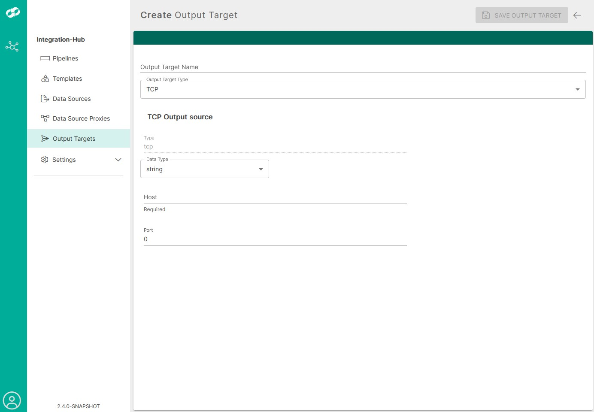

# aws-sqs-to-tcp Template

The aws-sqs-to-tcp template provides functionality to transfer, filter/transform and send from AWS SQS to a TCP listener, via an integration-hub pipeline.

## Configure

**Important:** _The following configuration applies ONLY to aws-sqs-to-tcp versions 2.3+_

This template requires that you have configured an `Output Target`, defining the destination for the processed data.

### Defining an Output Target

You can access the Output Targets by clicking on the `Output Targets` navigation item on the navbar on the left.

Here you will be presented with a list of Output Targets that have been configured previously.

 

To begin creating an Output Target, click the `CREATE OUTPUT TARGET` button located on the top-right of the page.

 

Currently, there are two output targets that you can define:

| Type               | Description                                                      |
| :--------------------- | :--------------------------------------------------------------- |
| `TCP`             | Sends the processed message to a TCP listener      |
| `FILE`             | Sends the processed message to a FILE on the local filesystem                                     |

#### TCP Properties

 

| Type               | Description                                                      |
| :--------------------- | :--------------------------------------------------------------- |
| `Output Target Name`             | Name of the Output Target you are creating      |
| `Data Type`             | Sends the processed message to a TCP listener      |
| `Host`             | Hostname or IP address of the TCP listener                                 |
| `Port`             | The port that the TCP listener listen on                                   |

#### FILE Properties

 

| Type               | Description                                                      |
| :--------------------- | :--------------------------------------------------------------- |
| `Output Target Name`             | Name of the Output Target you are creating     |
| `Data Type`             | Sends the processed message to a TCP listener      |
| `Directory Name`             | The full path to the directory on the local filesystem where the file is located                                 |
| `File Name`             | The name of the file to output the processed message to                                   |
| `Append Newline`             | Toggle to determine whether new messages should be added on a new line or directly appended to the existing text without a line break                                  |