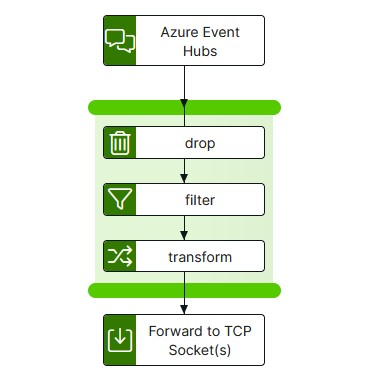

# azure-eventhubs-to-tcp Template

The azure-eventhubs-to-tcp template provides functionality to transfer, filter/transform and send from Azure Event Hubs to a TCP listener, via an integration-hub pipeline.

