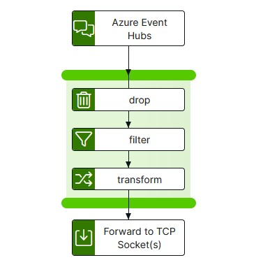

# azure-eventhubs-to-tcp Template

The azure-eventhubs-to-tcp template provides functionality to transfer, filter/transform and send from Azure Event Hubs to a TCP listener, via an integration-hub pipeline.

<p align="center">

</p>

---

## Install

Download the version of the azure-eventhubs-to-tcp template that you require from github to your integration-hub server.

Run the following to install directly from Github:

```bash
ih-cli template import \
  https://raw.githubusercontent.com/interlinksoftware/integrationhub/main/templates/azure-eventhubs-to-tcp/<version>/azure-eventhubs-to-tcp~<version>.yml
```

If your server does not have access to Github you can download the template file and place it in the `integration-hub/config/templates` directory.

---

### Creating a pipeline

You will need to create a pipeline to use a template. A sample pipeline definition is detailed in the README for each version of the template under the relevant directory, use that as a base for your pipeline.
