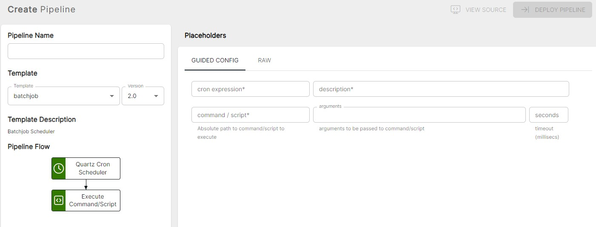

<p align="center">

</p>
<br><br>

# Batchjob (batchjob v2.1)

**Important:** _These instructions assume you have Integration Hub v2.1+ installed_

- For help installing [Integration Hub](https://docs.interlinksoftware.com/ih/latest/index.html), see the [Installation Guide](https://docs.interlinksoftware.com/ih/latest/install/install_overview.html).

## Overview

The batchjob template allows the execution of non-interactive commands and scripts against a schedule

## Prerequisites

Before creating the pipeline you will need have the following configured:

- The template is installed and is available within the user interface. Install directly from github or transfer the template to your Integration Hub server.

  - Installing directly from Github:

    ```
    ih-cli template import https://raw.githubusercontent.com/interlinksoftware/integrationhub/main/templates/batchjob/<version>/readme.md
    ```

  - Install from local file. Place the template file in the `integration-hub/config/templates` directory, then run:

    ```
    ih-cli template import <path to template file>
    ```

  **Note:** _You will need to reload the configuration after importing a template before you can use it, to do this run:_

  ```
  ih-cli config reload
  ```

## Configuration

From the Pipelines section of the user interface you can create, update and delete pipelines. The following properties can be set for your pipeline.



<br />

| Parameter          | Type                                                                                |
| :----------------- | :---------------------------------------------------------------------------------- |
| `Cron Expression`  | The cron expression that defines the execution schedule for this pipeline           |
| `Description`      | A description describing the purpose of this pipeline                               |
| `Command / Script` | Absolute path to the command / script to execute                                    |
| `Arguments`        | Arguments to be passed to the command / script                                      |
| `Seconds`          | The number of milliseconds to wait before terminating the command (default: 1 hour) |
