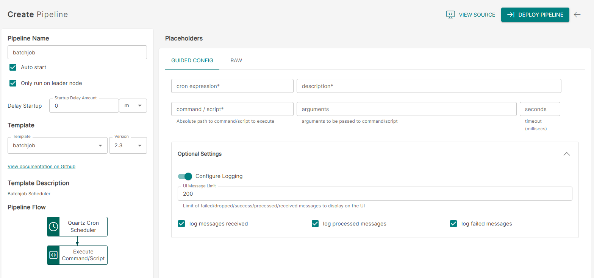

<p align="center">

</p>
<br><br>

# Batchjob (batchjob v2.3)

**Important:** _These instructions assume you have Integration Hub v2.3+ installed_

- For help installing [Integration Hub](https://docs.interlinksoftware.com/ih/latest/index.html), see the [Installation Guide](https://docs.interlinksoftware.com/ih/latest/install/install_overview.html).

## What's new in batchjob v2.3

| Enhancement, Fix or Feature                                               | ID      |
| :------------------------------------------------------------------------ | :------ |
| Add ability to configure logging for `Received`, `Failed` and `Processed` | IH-1014 |

## Overview

The batchjob template allows the execution of non-interactive commands and scripts against a schedule

## Prerequisites

Before creating the pipeline you will need have the following configured:

- The template is installed and is available within the user interface. Install directly from github or transfer the template to your Integration Hub server.
  - Installing directly from Github:

    ```
    ih-cli template import https://raw.githubusercontent.com/interlinksoftware/integrationhub/main/templates/batchjob/2.3/readme.md
    ```

  - Install from local file. Place the template file in the `integration-hub/config/templates` directory, then run:

    ```
    ih-cli template import <path to template file>
    ```

  **Note:** _You will need to reload the configuration after importing a template before you can use it, to do this run:_

  ```
  ih-cli config reload
  ```

## Configuration

From the Pipelines section of the user interface you can create, update and delete pipelines. The following properties can be set for your pipeline.



<br />

| Parameter          | Type                                                                                |
| :----------------- | :---------------------------------------------------------------------------------- |
| `Cron Expression`  | The cron expression that defines the execution schedule for this pipeline           |
| `Description`      | A description describing the purpose of this pipeline                               |
| `Command / Script` | Absolute path to the command / script to execute                                    |
| `Arguments`        | Arguments to be passed to the command / script                                      |
| `Seconds`          | The number of milliseconds to wait before terminating the command (default: 1 hour) |

#### Logging

| Parameter        | Type                                                                                                                                    |
| :--------------- | :-------------------------------------------------------------------------------------------------------------------------------------- |
| `logReceived`    | If enabled all messages received will be captured, the maximum number of entries is controlled by the `uiMessageLimit` property         |
| `logProcessed`   | If enabled all messages processed will be captured, the maximum number of entries is controlled by the `uiMessageLimit` property        |
| `logFailed`      | If enabled all messages that have failed will be captured, the maximum number of entries is controlled by the `uiMessageLimit` property |
| `uiMessageLimit` | Specifies the maximum number of messages to store for this pipeline, the default is `200`                                               |
