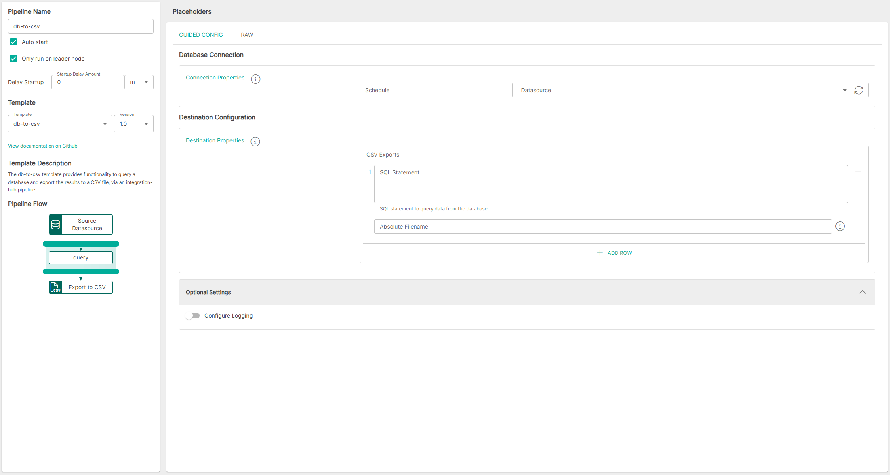

<p align="center">

</p>
<br><br>

# DB to TCP Listener (db-to-csv v1.0)

**Important:** _These instructions assume you have Integration Hub v2.2+ installed_

- For help installing [Integration Hub](https://docs.interlinksoftware.com/ih/latest/index.html), see the [Installation Guide](https://docs.interlinksoftware.com/ih/latest/install/install_overview.html).

## Overview

The db-to-csv template provides functionality to query a database and export the results to a CSV file, via an integration-hub pipeline.

## Prerequisites

Before creating the pipeline you will need have the following configured:

- The template is installed and is available within the user interface. Install directly from github or transfer the template to your Integration Hub server.

  - Installing directly from Github:

    ```
    ih-cli template import https://raw.githubusercontent.com/interlinksoftware/integrationhub/main/templates/db-to-csv/1.0/db-to-csv~1.0.yml
    ```

  - Install from local file. Place the template file in the `integration-hub/config/templates` directory, then run:

    ```
    ih-cli template import <path to template file>
    ```

  **Note:** _You will need to reload the configuration after importing a template before you can use it, to do this run:_

  ```
  ih-cli config reload
  ```

## Configuration

From the Pipelines section of the user interface you can create, update and delete pipelines. The following properties can be set for your pipeline.



### Database

| Property     | Description                                                 |
| :----------- | :---------------------------------------------------------- |
| `Schedule`   | The cron string that defines the schedule for this pipeline |
| `Datasource` | The JDBC data source name to use for the pipeline input     |

<br />

### Destination Configuration

| Property            | Description                                                                       |
| :------------------ | :-------------------------------------------------------------------------------- |
| `SQL Statement`     | Define the SQL statement that will be used to retrieve the data                   |
| `Absolute Filename` | Specify the full path to the output file that will be populated with the CSV data |

<br />

### Optional Settings

#### Logging

| Parameter        | Type                                                                                                                                              |
| :--------------- | :------------------------------------------------------------------------------------------------------------------------------------------------ |
| `logReceived`    | If enabled all messages received will be captured, the maximum number of entries is controlled by the `uiMessageLimit` property                   |
| `logDropped`     | If enabled all messages dropped will be captured, the maximum number of entries is controlled by the `uiMessageLimit` property                    |
| `logProcessed`   | If enabled all messages processed will be captured, the maximum number of entries is controlled by the `uiMessageLimit` property                  |
| `logSuccess`     | If enabled all messages that were successfuly sent will be captured, the maximum number of entries is controlled by the `uiMessageLimit` property |
| `logFailed`      | If enabled all messages that have failed will be captured, the maximum number of entries is controlled by the `uiMessageLimit` property           |
| `uiMessageLimit` | Specifies the maximum number of messages to store for this pipeline, the default is `200`                                                         |
