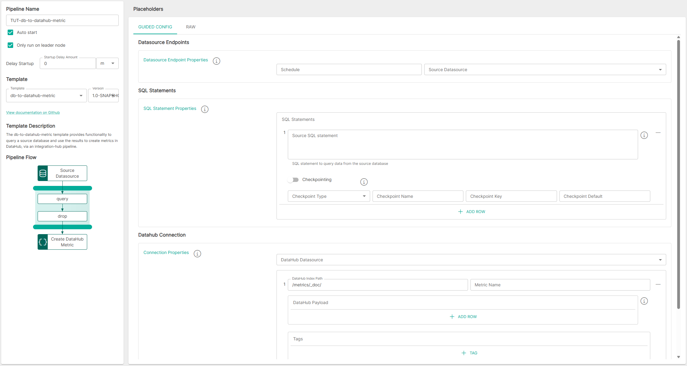
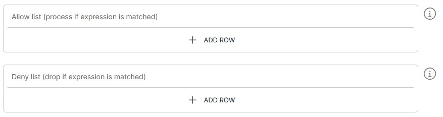

<p align="center">

</p>
<br><br>

# DB to DataHub Metric (db-to-datahub-metric v1.0)

**Important:** _These instructions assume you have Integration Hub v2.2+ installed_

- For help installing [Integration Hub](https://docs.interlinksoftware.com/ih/latest/index.html), see the [Installation Guide](https://docs.interlinksoftware.com/ih/latest/install/install_overview.html).

## Overview

The db-to-datahub-metric template provides functionality to query a source database and use the results to create metrics in DataHub, via an integration-hub pipeline.

## Prerequisites

Before creating the pipeline you will need have the following configured:

- The template is installed and is available within the user interface. Install directly from github or transfer the template to your Integration Hub server.

  - Installing directly from Github:

    ```
    ih-cli template import https://raw.githubusercontent.com/interlinksoftware/integrationhub/main/templates/db-to-datahub-metric/1.0/db-to-datahub-metric~1.0.yml
    ```

  - Install from local file. Place the template file in the `integration-hub/config/templates` directory, then run:

    ```
    ih-cli template import <path to template file>
    ```

  **Note:** _You will need to reload the configuration after importing a template before you can use it, to do this run:_

  ```
  ih-cli config reload
  ```

## Configuration

From the Pipelines section of the user interface, you can `create`, `update` and `delete` pipelines. The following properties can be set for your pipeline:



### Expression Syntax

Please be aware that the settings below make use of the following expression syntax

- Allow / Deny List

<br />

<table>
<tr>
    <th>Property</th>
    <th>Description</th>
</tr>
<tr valign="top">
    <td><code>Expression</code></td>
    <td>
        <blockquote><strong>field</strong> <i>operator</i> <strong>value</strong></blockquote>
        <br>
        <code>field:</code> The field that is referenced from the incoming message. To match this against the whole string, use <code>${bodyAs(String)}</code>
        <br>
        <code>value:</code> The value being tested against
        <br></br>
        <strong>operators:</strong>
        <br></br>
        <table>
            <tr>
                <th>Operator</th>
                <th>Description</th>
            </tr>
            <tr>
                <td><code>==</code></td>
                <td>equals</td>
            </tr>
            <tr>
                <td><code>=~</code></td>
                <td>equals (case insensitive)</td>
            </tr>
            <tr>
                <td><code>!=</code></td>
                <td>does not equal</td>
            </tr>
            <tr>
                <td><code>!=~</code></td>
                <td>does not equal (case insensitive)</td>
            </tr>
            <tr>
                <td><code>contains</code></td>
                <td>contains string</td>
            </tr>
            <tr>
                <td><code>!contains</code></td>
                <td>does not contain</td>
            </tr>
            <tr>
                <td><code>regex</code></td>
                <td>matches regex string</td>
            </tr>
            <tr>
                <td><code>!regex</code></td>
                <td>does not match regex string</td>
            </tr>
            <tr>
                <td><code>&&</code></td>
                <td>AND multiple expressions</td>
            </tr>
            <tr>
                <td><code>||</code></td>
                <td>OR multiple expressions</td>
            </tr>
        </table>
        <br>
        <strong>See examples below:</strong>
        <br></br>
        <table>
            <tr>
                <th>Expression</th>
                <th>Description</th>
            </tr>
            <tr>
                <td><code>${bodyAs(String)} regex '(?s)(.*?)'</code></td>
                <td>matches any string</td>
            </tr>
            <tr>
                <td><code>${bodyAs(String)} =~ 'this' && ${bodyAs(String)} !=~ 'that'</code></td>
                <td>incoming message contains 'this' but not 'that'</td>
            </tr>
            <tr>
                <td><code>${bodyAs(String)} =~ 'dog' || ${bodyAs(String)} !=~ 'cat'</code></td>
                <td>incoming message contains 'dog' or 'cat'</td>
            </tr>
            <tr>
                <td><code>${body[username]} == 'ppadmin'</code></td>
                <td>incoming message field 'username' equals 'ppadmin'</td>
            </tr>
            <tr>
                <td><code>${body[username]} != null</code></td>
                <td>incoming message field 'username' is not null</td>
            </tr>
            <tr>
                <td><code>${body[origindate]} == ${date:now:yyyyMMdd}</code></td>
                <td>incoming message field 'origindate' equals todays date</td>
            </tr>
        </table>
    </td>
</tr>
</table>

<br />

### Datasource Endpoints

The following properties can be specified for the Datasource Endpoints:

| Property            | Description                                                 |
| :------------------ | :---------------------------------------------------------- |
| `Schedule`          | The cron string that defines the schedule for this pipeline |
| `Source Datasource` | The data source name to use for the pipeline input          |

### SQL Statements

The following properties can be specified for the source SQL staements:

| Property               | Description                                                                                                     |
| :--------------------- | :-------------------------------------------------------------------------------------------------------------- |
| `Source SQL Statement` | The SQL Statement to query data from the source datasource                                                      |
| `Checkpointing`        | Toggle to enable / disable checkpointing<br/><br/>(More info can be found within the SQL statement definitions) |

### Datahub Connection

The following properties can be specified for the DataHub connection:

| Property             | Description                                                         |
| :------------------- | :------------------------------------------------------------------ |
| `DataHub Datasource` | Datasource that contains the connection details for DataHub         |
| `DataHub Index Path` | Path to the index in DataHub that you wish to send incoming data to |
| `Metric Name`        | A meaningful name for the metric that will be stored in DataHub     |
| `DataHub Payload`    | A map of key/value pairs, defining the payload to send to DataHub   |
| `Tags`               | A list of tags to add to the metric                                 |

### Optional Settings

#### Allow / Deny List

You can tailor message processing and transmission of incoming messages based on an [expression](#expression-syntax) by configuring the Allow/Deny list



<br />

#### Logging

| Parameter        | Type                                                                                                                                              |
| :--------------- | :------------------------------------------------------------------------------------------------------------------------------------------------ |
| `logReceived`    | If enabled all messages received will be captured, the maximum number of entries is controlled by the `uiMessageLimit` property                   |
| `logDropped`     | If enabled all messages dropped will be captured, the maximum number of entries is controlled by the `uiMessageLimit` property                    |
| `logProcessed`   | If enabled all messages processed will be captured, the maximum number of entries is controlled by the `uiMessageLimit` property                  |
| `logSuccess`     | If enabled all messages that were successfuly sent will be captured, the maximum number of entries is controlled by the `uiMessageLimit` property |
| `logFailed`      | If enabled all messages that have failed will be captured, the maximum number of entries is controlled by the `uiMessageLimit` property           |
| `uiMessageLimit` | Specifies the maximum number of messages to store for this pipeline, the default is `200`                                                         |
