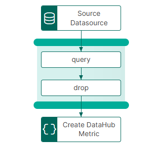

# db-to-datahub-metric Template

The db-to-datahub-metric template provides functionality to transfer, filter/transform and update data between databases using JDBC, via an integration-hub pipeline.

<p align="center">

</p>

## Configure

The db-to-datahub-metric template provides functionality to query a source database and use the results to create metrics in DataHub, via an integration-hub pipeline.

### Installing JDBC Drivers

Integration Hub supports the following database(s):

- H2
- PostgreSQL
- Oracle
- Microsoft SQL Server

### Defining Data Source Definitions

Configure the connection details for any new databases required for use in the pipeline. The connection details are defined in the **integration-hub/config/datasources.yml** file on the integration-hub instance.

The following properties are mandatory for each connection. (For a comprehensive list of additional properties see the <a href="https://commons.apache.org/proper/commons-dbcp/configuration.html" target="_isspop">commons-dcp</a> specification):

| Property          | Value                                                         |
| ----------------- | ------------------------------------------------------------- |
| `dataSourceName`  | Name of the Data Source                                       |
| `dataSourceType`  | The type of Data Source (rest \| jdbc)                        |
| `username`        | Database username                                             |
| `password`        | Encrypted database password                                   |
| `driverClassName` | Fully qualified Java class name of the JDBC driver to be used |
| `url`             | JDBC connection Url                                           |

You can refer to secrets from the management-service vault within the configuration file by enclosing them with `${}`:

```yml
${sqlserver_password}
```

For more information on how this is done refer to the vault section of the management-service on the Interlink documentation site.

#### Data Source Examples

```
    postgresExample:
        dataSourceName: mydb
        dataSourceType: jdbc
        username: ${postgres_username}
        password: ${postgres_password}
        type: org.apache.commons.dbcp2.BasicDataSource
        driverClassName: org.postgresql.Driver
        url: jdbc:postgresql://localhost:5432/mydb

    sqlServerExample:
        dataSourceName: mydb
        dataSourceType: jdbc
        username: ${sqlserver_username}
        password: ${sqlserver_password}
        type: org.apache.commons.dbcp2.BasicDataSource
        driverClassName: net.sourceforge.jtds.jdbc.Driver
        url: "jdbc:jtds:sqlserver://sqlserver.interlink.com;databaseName=mydb;"
        validationQuery: "select 1"

    oracleServerExample:
        dataSourceName: mydb
        dataSourceType: jdbc
        username: ${oracleserver_username}
        password: ${oracleserver_password}
        type: org.apache.commons.dbcp2.BasicDataSource
        driverClassName: oracle.jdbc.driver.OracleDriver
        url: "jdbc:oracle:thin:@oracleserver.int-link.com:1521:xe"
```

---
