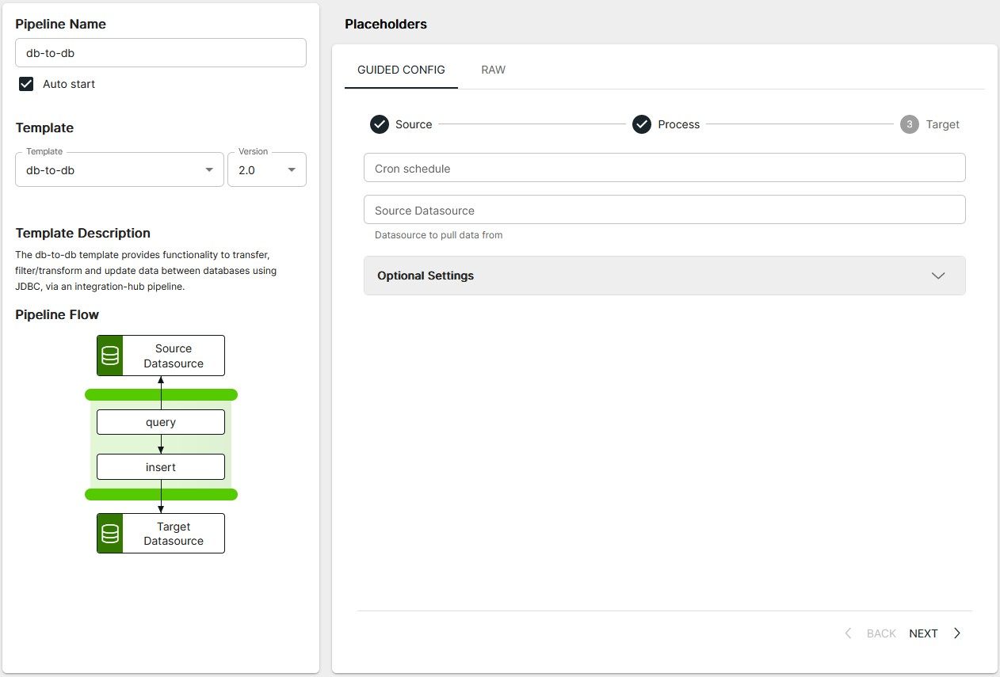
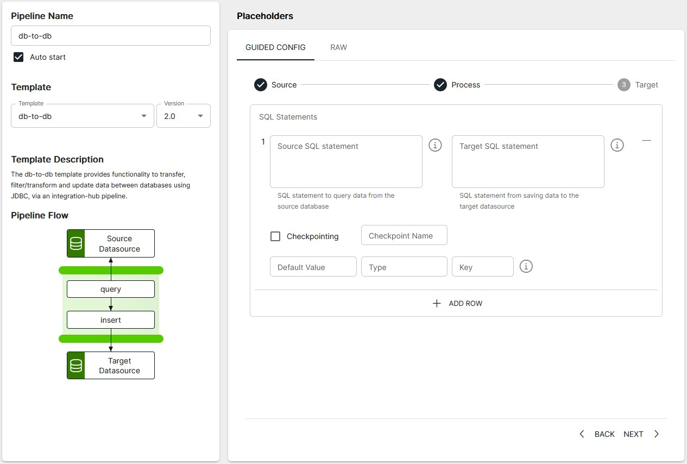
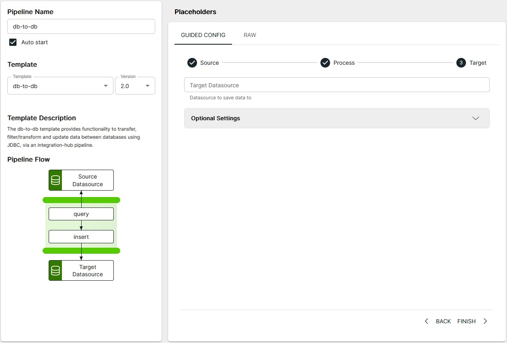

<p align="center">

</p>
<br><br>

# DB to DB (db-to-db v2.0)

**Important:** _These instructions assume you have Integration Hub v2.0.0+ installed_

- For help installing [Integration Hub](https://docs.interlinksoftware.com/ih/latest/index.html), see the [Installation Guide](https://docs.interlinksoftware.com/ih/latest/install/install_overview.html).

## Overview

The db-to-db template provides functionality to transfer, filter/transform and update data between databases using JDBC, via an integration-hub pipeline.

## Prerequisites

Before creating the pipeline you will need have the following configured:

- The template is installed and is available within the user interface. Install directly from github or transfer the template to your Integration Hub server.

  - Installing directly from Github:

    ```
    ih-cli template import https://raw.githubusercontent.com/interlinksoftware/integrationhub/main/templates/db-to-db/<version>/readme.md
    ```

  - Install from local file. Place the template file in the `integration-hub/config/templates` directory, then run:

    ```
    ih-cli template import <path to template file>
    ```

  **Note:** _You will need to reload the configuration after importing a template before you can use it, to do this run:_

  ```
  ih-cli config reload
  ```

## Configuration

From the Pipelines section of the user interface you can create, update and delete pipelines. The following properties can be set for your pipeline.

### Source



<br />

| Parameter           | Type                                                        |
| :------------------ | :---------------------------------------------------------- |
| `Cron Schedule`     | The cron string that defines the schedule for this pipeline |
| `Source Datasource` | The data source name to use for the pipeline input          |

#### Optional Settings

| Parameter               | Type                                                                                                             |
| :---------------------- | :--------------------------------------------------------------------------------------------------------------- |
| `UI Message Limit`      | The limit of failed/dropped/success/processed/received messages to display in the UI                             |
| `Log Messages Received` | To log all retrieved data set this to true. The received file is **logs/\<pipeline name\>-\<yyyymmdd>.received** |

### Process



<br />

<table>
    <tr>
        <th>Property</th>
        <th>Description</th>
    </tr>
    <tr>
        <td><code>Source SQL Statement</code></td>
        <td>
            The SQL statement to execute against the source Data Source
            <br />
            <h4>How to specify a checkpoint value in the source SQL statement</h4>
            <pre># Select records from iss_pp_alerts_table and only return records > the last alertid from the previous execution <br />
SELECT * FROM iss_pp_alerts_table where alertid >= ${exchange.properties.checkpointValue}</pre>
        </td>
    </tr>
    <tr>
        <td><code>Target SQL Statement</code></td>
        <td>
            Specify the SQL command that will be executed against each row returned from the data returned by the <code>sourceSqlStatement</code>. It is recommended that you use preparedStatement field definitions to protect against SQL injection, these are specified as <code>:?fieldname:</code>
            <br />
            <h4>See examples below:</h4>
            <pre># Insert statement passing alertId value as SQL prepared statement can cast as an integer
INSERT INTO dev_alertIds(alertid) VALUES(:?alertid::integer)</pre>
            <br />
            <pre># Call stored procedure user_updates_insert as a SQL prepared statement and pass parameters from the source record.
CALL user_updates_insert(:?ldate::text, :?stime::text, :?usersite::text, :?users::text, :?source::text, :?dateimported::timestamp)</pre>
        </td>
    </tr>
    <tr>
        <td><code>Checkpointing</code></td>
        <td>Enable checkpointing for this pipeline</td>
    </tr>
    <tr>
        <td><code>Checkpoint Name</code></td>
        <td>A unique name for this checkpoint field</td>
    </tr>
    <tr>
        <td><code>Default Value</code></td>
        <td>A default value to be used when the pipeline is first run or if a value cannot be determined</td>
    </tr>
    <tr>
        <td><code>Type</code></td>
        <td>The SQL data type (ie: date, integer, text)</td>
    </tr>
    <tr>
        <td><code>Key</code></td>
        <td>The field returned from the SQL source statement whose value is stored</td>
    </tr>
</table>

### Target



<br />

| Parameter           | Type                                                |
| :------------------ | :-------------------------------------------------- |
| `Target Datasource` | The data source name to use for the pipeline output |

#### Optional Settings

| Parameter      | Type                                                                                                                                                    |
| :------------- | :------------------------------------------------------------------------------------------------------------------------------------------------------ |
| `logProcessed` | To log all target SQL statements set this to true. The received file is **logs/\<pipeline name>-\<yyyymmdd>.processed**                                 |
| `logSent`      | To log messages that were successfully sent to the tcp destination, set this to true. The success file is **logs/\<pipeline name>-\<yyyymmdd>.success** |
| `logFailed`    | To log messages that were successfully sent to the tcp destination, set this to true. The success file is **logs/\<pipeline name>-\<yyyymmdd>.success** |
