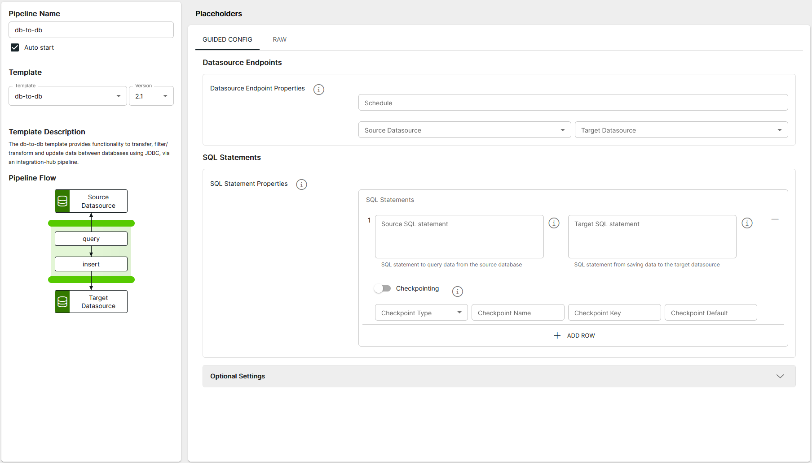

<p align="center">

</p>
<br><br>

# DB to DB (db-to-db v2.1)

**Important:** _These instructions assume you have Integration Hub v2.2.0+ installed_

- For help installing [Integration Hub](https://docs.interlinksoftware.com/ih/latest/index.html), see the [Installation Guide](https://docs.interlinksoftware.com/ih/latest/install/install_overview.html).

## Overview

The db-to-db template provides functionality to transfer, filter/transform and update data between databases using JDBC, via an integration-hub pipeline.

## Prerequisites

Before creating the pipeline you will need have the following configured:

- The template is installed and is available within the user interface. Install directly from github or transfer the template to your Integration Hub server.

  - Installing directly from Github:

    ```
    ih-cli template import https://raw.githubusercontent.com/interlinksoftware/integrationhub/main/templates/db-to-db/2.1/readme.md
    ```

  - Install from local file. Place the template file in the `integration-hub/config/templates` directory, then run:

    ```
    ih-cli template import <path to template file>
    ```

  **Note:** _You will need to reload the configuration after importing a template before you can use it, to do this run:_

  ```
  ih-cli config reload
  ```

## Configuration

From the Pipelines section of the user interface you can create, update and delete pipelines. The following properties can be set for your pipeline.



<br />

### Datasource Endpoints

| Parameter           | Type                                                        |
| :------------------ | :---------------------------------------------------------- |
| `Schedule`     | The cron string that defines the schedule for this pipeline |
| `Source Datasource` | The data source name to use for the pipeline input          |
| `Target Datasource` | The data source name to use for the pipeline output |

### SQL Statements

| Parameter           | Type                                                        |
| :------------------ | :---------------------------------------------------------- |
| `Source SQL Statement`     | The SQL Statement to query data from the source datasource |
| `Target SQL Statement` | The SQL Statement to execute against the target datasource |
| `Checkpointing` | Toggle to enable / disable checkpointing |

#### Source SQL Statement

The SQL statement to execute against the source DataSource. Here is how you would specify a **checkpoint value** in the source SQL statement:

```sql
# Select records from iss_pp_alerts_table and only return records > the last alertid from the previous execution

SELECT * FROM iss_pp_alerts_table where alertid >= ${exchange.properties.checkpointValue}
```

#### Target SQL Statement

The SQL statement that will be executed against each row returned from the `sourceSqlStatement`.

It is recommended that you use **preparedStatement** field definitions to protect against SQL injection, these are specified as `:?fieldname:` For example:

```sql
# Insert statement passing alertId value as SQL prepared statement can cast as an integer

INSERT INTO dev_alertIds(alertid) VALUES(:?alertid::integer)
```

<br />

```sql
# Call stored procedure user_updates_insert as a SQL prepared statement and pass parameters from the source record.

CALL user_updates_insert(:?ldate::text, :?stime::text, :?usersite::text, :?users::text, :?source::text, :?dateimported::timestamp)
```

### Optional Settings

| Parameter      | Type                                                                                                                                                    |
| :------------- | :------------------------------------------------------------------------------------------------------------------------------------------------------ |
| `UI Message Limit` | Limit of failed/dropped/sucess/processed/received messages to display on the UI |
| `logReceived`    | If enabled all messages received will be captured, the maximum number of entries is controlled by the `uiMessageLimit` property                   |
| `logProcessed` | To log all target SQL statements set this to true. The received file is **logs/\<pipeline name>-\<yyyymmdd>.processed**                                 |
| `logSent`      | To log messages that were successfully sent to the tcp destination, set this to true. The success file is **logs/\<pipeline name>-\<yyyymmdd>.success** |
| `logFailed`    | To log messages that were successfully sent to the tcp destination, set this to true. The success file is **logs/\<pipeline name>-\<yyyymmdd>.success** |
