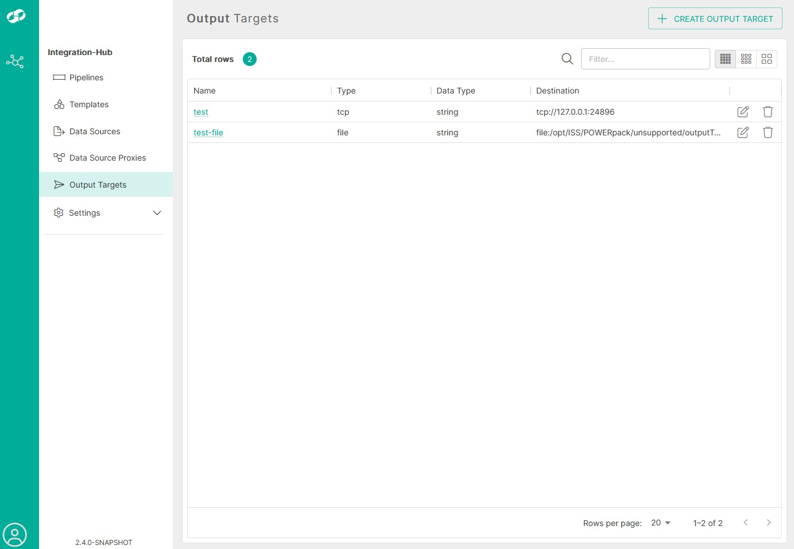

# db-to-tcp Template

The db-to-tcp template provides functionality to transfer, filter/transform and update data between a database (using JDBC) and a TCP Listener, via an integration-hub pipeline.

<p align="center">

</p>

***

## Install

Download the version of the db-to-tcp template that you require from github to your integration-hub server.

Install directly from Github
<font size="1">
```bash
ih-cli template import \
  https://raw.githubusercontent.com/interlinksoftware/integrationhub/main/templates/db-to-tcp/<version>/readme.md
```
  </font>
  
If your server does not have access to Github you can download the template file and place it in the ```integration-hub/config/templates``` directory.

***

## Configure

This template will require you to install the relevant JDBC drivers and define the Data Sources that you wish to use. If you wish to forward to an Interlink Software BES Message Channel then you should create a TCP based Message Channel before continuing.

### Installing JDBC Drivers

For the integration-hub to support the database(s) you wish to use, you will need to copy the relevant JDBC driver(s) jar files into the **integration-hub/config/lib** directory, then restart the integration-hub to make them available within the pipeline.

|database drivers|
---------|
|[Postgres][postgres_download]|
|[Oracle][oracle_download]|
|[Microsoft SQL Server][sqlserver_download]

[postgres_download]: https://jdbc.postgresql.org/download.html
[oracle_download]: https://www.oracle.com/uk/database/technologies/appdev/jdbc-downloads.html
[sqlserver_download]: https://docs.microsoft.com/en-us/sql/connect/jdbc/download-microsoft-jdbc-driver-for-sql-server?view=sql-server-ver15

***

### Defining Data Source Definitions

Configure the connection details for any new databases required for use in the pipeline.  The connection details are defined in the **integration-hub/config/datasources.yml** file on the integration-hub instance.

The following properties are mandatory for each connection. (For a comprehensive list of additional properties see the <a href="https://commons.apache.org/proper/commons-dbcp/configuration.html" target="_isspop">commons-dcp</a> specification):


|Property | Value|
|----------|------|
|driverClassName | Fully qualified Java class name of the JDBC driver to be used|
|url | JDBC connection Url|
|username | Database username|
|password | Encrypted database password|

You can refer to secrets from the management-service vault within the configuration file by enclosing them with `${}`:

```yml
  ${sqlserver_password}
```

For more information on how this is done refer to the vault section of the management-service on the Interlink documentation site.

#### Data Source Examples

```
    postgresExample:
        type: org.apache.commons.dbcp2.BasicDataSource
        driverClassName: org.postgresql.Driver
        username: ${postgres_username}
        password: ${postgres_password}
        url: "jdbc:postgresql://postgres.interlink.com:5432/mydb"

    sqlServerExample:
        type: org.apache.commons.dbcp2.BasicDataSource
        driverClassName: net.sourceforge.jtds.jdbc.Driver
        username: ${sqlserver_username}
        password: ${sqlserver_password}
        url: "jdbc:jtds:sqlserver://sqlserver.interlink.com;databaseName=mydb;"
        validationQuery: "select 1"
```
***

### Defining an Output Target

**Important:** _The following configuration applies ONLY to syslog-to-tcp versions 2.2+_

This template requires that you have configured an `Output Target`, defining the destination for the processed data.

You can access the Output Targets by clicking on the `Output Targets` navigation item on the navbar on the left.

Here you will be presented with a list of Output Targets that have been configured previously.



<br />

To begin creating an Output Target, click the `CREATE OUTPUT TARGET` button located on the top-right of the page.


<br />

Currently, there are two output targets that you can define:

| Type               | Description                                                      |
| :--------------------- | :--------------------------------------------------------------- |
| `TCP`             | Sends the processed message to a TCP listener      |
| `FILE`             | Sends the processed message to a FILE on the local filesystem                                     |

#### TCP Properties


<br />

| Type               | Description                                                      |
| :--------------------- | :--------------------------------------------------------------- |
| `Output Target Name`             | Name of the Output Target you are creating      |
| `Data Type`             | Sends the processed message to a TCP listener      |
| `Host`             | Hostname or IP address of the TCP listener                                 |
| `Port`             | The port that the TCP listener listen on                                   |

#### FILE Properties


<br />

| Type               | Description                                                      |
| :--------------------- | :--------------------------------------------------------------- |
| `Output Target Name`             | Name of the Output Target you are creating     |
| `Data Type`             | Sends the processed message to a TCP listener      |
| `Directory Name`             | The full path to the directory on the local filesystem where the file is located                                 |
| `File Name`             | The name of the file to output the processed message to                                   |
| `Append Newline`             | Toggle to determine whether new messages should be added on a new line or directly appended to the existing text without a line break                                  |

### Creating a pipeline

You will need to create a pipeline to use a template. A sample pipeline definition is detailed in the README for each version of the template under the relevant directory, use that as a base for your pipeline.
