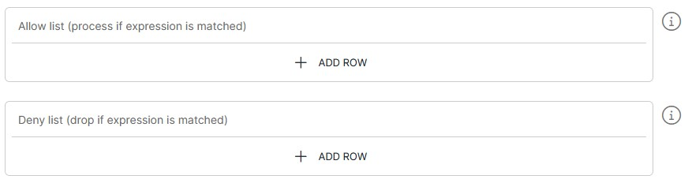

<p align="center">

</p>
<br><br>

# File to TCP Listener (file-to-tcp v2.4)

**Important:** _These instructions assume you have Integration Hub v2.4+ installed_

- For help installing [Integration Hub](https://docs.interlinksoftware.com/ih/latest/index.html), see the [Installation Guide](https://docs.interlinksoftware.com/ih/latest/install/install_overview.html).

## What's new in file-to-tcp v2.4

| Enhancement or Feature                                                                           | ID     |
| :----------------------------------------------------------------------------------------------- | :----- |
| Wire in `checkpointDirectory` to save checkpoint files to the configuration directory by default | IH-810 |
| Allow the `checkpointDirectory` default location to be overridden                                | IH-819 |

## Overview

The file-to-tcp template provides functionality to read a files contents and forward it on to a TCP listener, via an integration-hub pipeline.

## Prerequisites

Before creating the pipeline you will need have the following configured:

- An [Output Target](https://github.com/interlinksoftware/integrationhub/tree/main/templates/file-to-tcp#defining-an-output-target), defining the destination for the processed data.

- The template is installed and is available within the user interface. Install directly from github or transfer the template to your Integration Hub server.

  - Installing directly from Github:

    ```
    ih-cli template import https://raw.githubusercontent.com/interlinksoftware/integrationhub/main/templates/file-to-tcp/2.4/file-to-tcp~2.4.yml
    ```

  - Install from local file. Place the template file in the `integration-hub/config/templates` directory, then run:

    ```
    ih-cli template import <path to template file>
    ```

  **Note:** _You will need to reload the configuration after importing a template before you can use it, to do this run:_

  ```
  ih-cli config reload
  ```

## Configuration

From the Pipelines section of the user interface you can create, update and delete pipelines. The following properties can be set for your pipeline.


### File Configuration

| Property               | Description                                             |
| :--------------------- | :------------------------------------------------------ |
| `Directory`            | The directory name the files are stored in              |
| `File Name`            | The file name that you want to read from                |
| `charset`              | This option is used to specify the encoding of the file |
| `Checkpoint Directory` | The directory where the checkpoint files will be stored |

<br />

### Destination Configuration

The destination configuration specifies where the processed data should be sent. You can choose a single output target or configure multiple targets as needed.


## Optional Settings

### Expression Syntax

Please be aware that the settings below make use of the following expression syntax

- Allow / Deny List

<br />

<table>
<tr>
    <th>Property</th>
    <th>Description</th>
</tr>
<tr valign="top">
    <td><code>Expression</code></td>
    <td>
        <blockquote><strong>field</strong> <i>operator</i> <strong>value</strong></blockquote>
        <br>
        <code>field:</code> The field that is referenced from the incoming message. To match this against the whole string, use <code>${bodyAs(String)}</code>
        <br>
        <code>value:</code> The value being tested against
        <br></br>
        <strong>operators:</strong>
        <br></br>
        <table>
            <tr>
                <th>Operator</th>
                <th>Description</th>
            </tr>
            <tr>
                <td><code>==</code></td>
                <td>equals</td>
            </tr>
            <tr>
                <td><code>=~</code></td>
                <td>equals (case insensitive)</td>
            </tr>
            <tr>
                <td><code>!=</code></td>
                <td>does not equal</td>
            </tr>
            <tr>
                <td><code>!=~</code></td>
                <td>does not equal (case insensitive)</td>
            </tr>
            <tr>
                <td><code>contains</code></td>
                <td>contains string</td>
            </tr>
            <tr>
                <td><code>!contains</code></td>
                <td>does not contain</td>
            </tr>
            <tr>
                <td><code>regex</code></td>
                <td>matches regex string</td>
            </tr>
            <tr>
                <td><code>!regex</code></td>
                <td>does not match regex string</td>
            </tr>
            <tr>
                <td><code>&&</code></td>
                <td>AND multiple expressions</td>
            </tr>
            <tr>
                <td><code>||</code></td>
                <td>OR multiple expressions</td>
            </tr>
        </table>
        <br>
        <strong>See examples below:</strong>
        <br></br>
        <table>
            <tr>
                <th>Expression</th>
                <th>Description</th>
            </tr>
            <tr>
                <td><code>${bodyAs(String)} regex '(?s)(.*?)'</code></td>
                <td>matches any string</td>
            </tr>
            <tr>
                <td><code>${bodyAs(String)} =~ 'this' && ${bodyAs(String)} !=~ 'that'</code></td>
                <td>incoming message contains 'this' but not 'that'</td>
            </tr>
            <tr>
                <td><code>${bodyAs(String)} =~ 'dog' || ${bodyAs(String)} !=~ 'cat'</code></td>
                <td>incoming message contains 'dog' or 'cat'</td>
            </tr>
            <tr>
                <td><code>${body[username]} == 'ppadmin'</code></td>
                <td>incoming message field 'username' equals 'ppadmin'</td>
            </tr>
            <tr>
                <td><code>${body[username]} != null</code></td>
                <td>incoming message field 'username' is not null</td>
            </tr>
            <tr>
                <td><code>${body[origindate]} == ${date:now:yyyyMMdd}</code></td>
                <td>incoming message field 'origindate' equals todays date</td>
            </tr>
        </table>
    </td>
</tr>
</table>

<br />

### Include Headers in Processed Message

By toggling `Include Headers in Processed Message`, all headers present in the exchange will be appended to the processed message. If you prefer the processed message to contain only the text read from the file, set this toggle to `false`

### Allow / Deny List

You can tailor message processing and transmission to the TCP listener based on an [expression](#expression-syntax) by configuring the Allow/Deny list



<br />

### Logging

| Parameter        | Type                                                                                                                                               |
| :--------------- | :------------------------------------------------------------------------------------------------------------------------------------------------- |
| `logReceived`    | If enabled all messages received will be captured, the maximum number of entries is controlled by the `uiMessageLimit` property                    |
| `logDropped`     | If enabled all messages dropped will be captured, the maximum number of entries is controlled by the `uiMessageLimit` property                     |
| `logProcessed`   | If enabled all messages processed will be captured, the maximum number of entries is controlled by the `uiMessageLimit` property                   |
| `logSuccess`     | If enabled all messages that were successfully sent will be captured, the maximum number of entries is controlled by the `uiMessageLimit` property |
| `logFailed`      | If enabled all messages that have failed will be captured, the maximum number of entries is controlled by the `uiMessageLimit` property            |
| `uiMessageLimit` | Specifies the maximum number of messages to store for this pipeline, the default is `200`                                                          |
