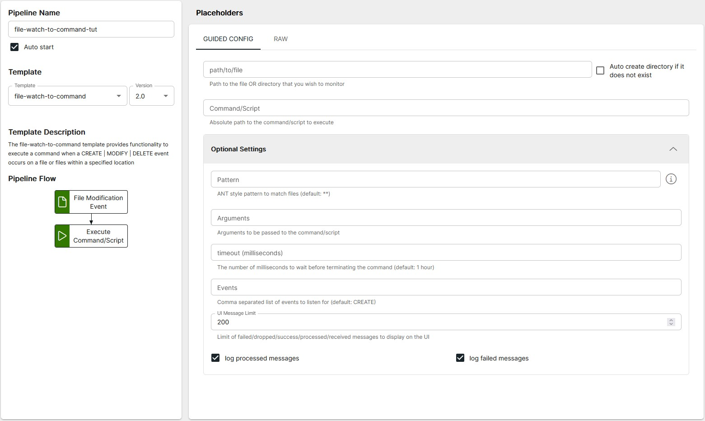

<p align="center">

</p>
<br><br>

# File-Watch to Command <small>(file-watch-to-command v2.0)</small>

**Important:** _These instructions assume you have Integration Hub v2.1+ installed_

- For help installing [Integration Hub](https://docs.interlinksoftware.com/ih/latest/index.html), see the [Installation Guide](https://docs.interlinksoftware.com/ih/latest/install/install_overview.html).

## Overview

The file-watch-to-command template provides functionality to execute a command when a CREATE | MODIFY | DELETE event occurs on a file or files within a specified location

## Prerequisites

Before creating the pipeline you will need have the following configured:

- The template is installed and is available within the user interface. Install directly from github or transfer the template to your Integration Hub server.

  - Installing directly from Github:

    ```
    ih-cli template import https://raw.githubusercontent.com/interlinksoftware/integrationhub/main/templates/file-watch-to-command/<version>/readme.md
    ```

  - Install from local file. Place the template file in the `integration-hub/config/templates` directory, then run:

    ```
    ih-cli template import <path to template file>
    ```

  **Note:** _You will need to reload the configuration after importing a template before you can use it, to do this run:_

  ```
  ih-cli config reload
  ```

## Configuration

From the Pipelines section of the user interface you can create, update and delete pipelines. The following properties can be set for your pipeline.



<br />

| Property                                     | Description                                            |
| :------------------------------------------- | :----------------------------------------------------- |
| `path/to/file`                               | Path to the file OR directory that you want to monitor |
| `Auto create directory if it does not exist` | Set to `true` to enable this functionality             |
| `Command / Script`                           | Absolute path to the command / script to execute       |

### Optional Settings

| Property           | Description                                                                      |
| :----------------- | :------------------------------------------------------------------------------- |
| `Pattern`          | ANT style pattern to match files (default: \*\*)                                 |
| `Arguments`        | Arguments to be passed to the command / script                                   |
| `Timeout`          | The number of milliseconds to wait before terminating the command                |
| `Events`           | Comma separated list of events to listen for (CREATE \| MODIFY \| DELETE)        |
| `UI Message Limit` | Limit of failed/dropped/success/processed/received messages to display in the UI |

## Logging

| Property       | Description                                                                                                                             |
| :------------- | :-------------------------------------------------------------------------------------------------------------------------------------- |
| `logProcessed` | If enabled all messages processed will be captured, the maximum number of entries is controlled by the `uiMessageLimit` property        |
| `logFailed`    | If enabled all messages that have failed will be captured, the maximum number of entries is controlled by the `uiMessageLimit` property |
