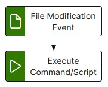

# file-watch-to-command Template

The file-watch-to-command template provides functionality to execute a command when a CREATE | MODIFY | DELETE event occurs on a file or files within a specified location

