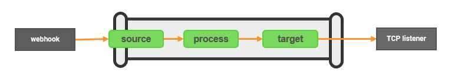

# https-to-tcp Template

The https-to-tcp template provides a secure HTTP endpoint that 3rd Party applications can target to transfer data via a webhook.  The integration-hub pipeline transfers, filters/transforms and updates the data, passing it out to the target TCP Listener.

<p align="center">

</p>

***

## Install

Download the version of the https-to-tcp template that you require from github to your integration-hub server.

Run the following to install directly from Github:
<font size="1">
```bash
ih-cli template import \
  https://raw.githubusercontent.com/interlinksoftware/integrationhub/main/templates/https-to-tcp/<version>/https-to-tcp~<version>.yml
```
  </font>
  
If your server does not have access to Github you can download the file, copy to the server and place it directly into the ```integration-hub/config/templates``` directory or import via the integration-hub cli:
```bash
ih-cli template import /path/to/file/https-to-tcp~<version>.yml
```
***

## Configure

If you wish to forward to an Interlink Software BES Message Channel then you should create a TCP based Message Channel before continuing.

### Creating a pipeline

You will need to create a pipeline to use a template. A sample pipeline definition is detailed in the README for each version of the template under the relevant directory, use that as a base for your pipeline.

## Migrating from piHTTP to https-to-tcp based pipeline

If you wish to migrate from piHTTP to integration-hub, then perform the following steps:
- Ensure that the integration-hub has been installed to the BES server containing the piHTTP integration and that the ```piHTTP.cfg``` to be converted exists in the  */opt/ISS/POWERpack/cfg* directory.
- Confirm you have installed the https-to-tcp template to the */opt/ISS/integration-hub/config/templates* directory.
- Create a TCP based BES Message Channel to receive the messages from the pipeline(s).
- Download the 
  ```convertBesPihttpToPipeline``` from Github, this can be manually downloaded and placed in the **/opt/ISS/integration-hub/config** directory or using the command below as the ppadmin user.
  ```bash
  cd /opt/ISS/integration-hub/config
  curl -k -O https://raw.githubusercontent.com/interlinksoftware/integrationhub/main/templates/https-to-tcp/convertBesPihttpToPipeline
  chmod +x convertBesPihttpToPipeline
  ```
  
- Execute the conversion utility as the ppadmin user and enter both the Fully Qualified Domain Name of the target BES server and the tcp port number of the BES Message Channel created above when prompted.
  ```bash
  cd /opt/ISS/integration-hub/config
  ./convertBesPihttpToPipeline
  ```
A new pipeline file, ```piHTTP.yml```, will be created in the same directory where the ```convertBesPihttpToPipeline``` file resides for the piHTTP message channel being converted.  To activate the converted pipeline:
- Ensure that references to both the https-to-tcp template and the converted pipeline .yml files have been added to the **pipelines.yml** file to add them to your integration-hub instance.
- Stop the original piHTTP message channel, if necessary, as the converted piHTTP pipeline will be listening on the original piHTTP message channel port.
- Restart the integration-hub service to pick up the changes.
