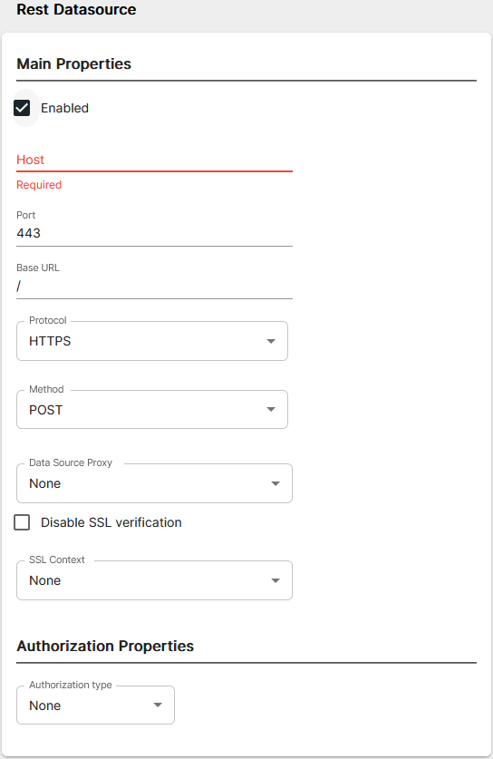

# ird-to-remedy Template

The ird-to-remedy template enables the integration of BES (ird) with BMC Remedy. It allows alert creation, note addition, and closure events within BES to correspondingly create, update, and close incidents or changes within BMC Remedy

<p align="center">

</p>

## Prerequisites

### UserAO

This template requires that a UserAO is configured in ASI to trigger the `createIncident` utility. More information can be found on our documentation site: [Configure User Automated Operations](https://docs.interlinksoftware.com/asi/2.7.13/configuration/automation/automation.html)

### Remedy Datasource

A REST datasource needs to be defined in Integration Hub that connects to your Remedy environment.

<p align="center">

</p>

#### Defining Data Source Definitions

A REST datasource can be configured from directly within the Integration Hub UI. The connection details can then be found in the `integration-hub/config/datasources.yml` file on the system that hosts your integration-hub environment.

The following properties are mandatory for each connection:

<table>
    <tr>
        <td><code>Host</code></td>
        <td>The hostname / IP address of the REST endpoint (minus the protocol i.e - HTTP/HTTPS)</td>
    </tr>
    <tr>
        <td><code>Port</code></td>
        <td>The port that the REST endpoint listens on</td>
    </tr>
    <tr>
        <td><code>Base URL</code></td>
        <td>The base URL path to add to subsequent requests</td>
    </tr>
    <tr>
        <td><code>Protocol</code></td>
        <td>The HTTP protocol to use when connecting to the REST endpoint i.e - HTTP/HTTPS</td>
    </tr>
    <tr>
        <td><code>Method</code></td>
        <td>The HTTP method to be used</td>
    </tr>
    <tr>
        <td><code>Data Source Proxy</code></td>
        <td>If you need to use a proxy to make the connection, specify a pre-defined PROXY datasource</td>
    </tr>
    <tr>
        <td><code>Disable SSL Verification</code></td>
        <td>Toggle to disable SSL certificate verification when making the request</td>
    </tr>
    <tr>
        <td><code>SSL Context</code></td>
        <td>If you need to use custom CA certificate(s) then select the pre-defined SSL context</td>
    </tr>
    <tr>
        <td><code>Authorization Type</code></td>
        <td>Specify authentication method to use<br><br>
            <details>
            <summary>Basic Auth</summary>
            <table>
                <tr>
                    <td><code>Username</code></td>
                    <td>The username for authenticating</td>
                </tr>
                <tr>
                    <td><code>Password</code></td>
                    <td>The password for authenticating</td>
                </tr>
                <tr>
                    <td><code>Authorization Header Prefix</code></td>
                    <td>The authorization token type</td>
                </tr>
                <tr>
                    <td><code>Authorization Header Name</code></td>
                    <td>The authorization name</td>
                </tr>
                <tr>
                    <td><code>SSL Context</code></td>
                    <td>If you need to use custom CA certificate(s) then select the pre-defined SSL context</td>
                </tr>
            </table>
            </details>
            <details>
                <summary>OAuth</summary>
                <table>
                    <tr>
                        <td><code>Host</code></td>
                        <td>The hostname for authenticating<br> azure: <code>login.microsoftonline.com</code></td>
                    </tr>
                    <tr>
                        <td><code>Authorization Url</code></td>
                        <td>The endpoint for the API provider authorization server, to retrieve the auth code<br> azure: <code>/&lt;TENANT ID&gt;/oauth2/v2.0/authorize</code><br></td>
                    </tr>
                    <tr>
                        <td><code>Token Url</code></td>
                        <td>The provider's authentication server, to exchange an authorization code for an access token<br> azure: <code>/&lt;TENANT ID&gt;/oauth2/v2.0/token</code</td>
                    </tr>
                    <tr>
                        <td><code>Redirect Url</code></td>
                        <td>The redirect_uri is must match one of the URLs the developer registered when creating the application, and the authorization server should reject the request if it does not match.</td>
                    </tr>
                    <tr>
                        <td><code>Client Secret</code></td>
                        <td>The client secret given to you by the API provider</td>
                    </tr>
                    <tr>
                        <td><code>Client Id</code></td>
                        <td>The ID for your client application registered with the API provider</td>
                    </tr>
                    <tr>
                        <td><code>Scope</code></td>
                        <td>The scope of access you are requesting, which may include multiple space-separated values <br> azure: <code>https://graph.microsoft.com/.default</code> </td>
                    </tr>
                    <tr>
                        <td><code>Grant Type</code></td>
                        <td>This will depend on the API service provider requirements</td>
                    </tr>
                    <tr>
                        <td><code>Token Refresh</code></td>
                        <td>The unit that should be combined with the *Token Refresh Unit*, refreshing the token will happen at this interval</td>
                    </tr>
                    <tr>
                        <td><code>Token Refresh Unit</code></td>
                        <td>This can be Seconds, Minutes, Hours or Days</td>
                    </tr>
                    <tr>
                        <td><code>Authorization Header Prefix</code></td>
                        <td>The authorization token type</td>
                    </tr>
                    <tr>
                        <td><code>Authorization Header Name</code></td>
                        <td>The authorization name</td>
                    </tr>
                    <tr>
                        <td><code>Mail Support</code></td>
                        <td>Set to true if connecting to Azure and you are wanting to interact with mail component</td>
                    </tr>
                    <tr>
                        <td><code>SSL Context</code></td>
                        <td>If you need to use custom CA certificate(s) then select the pre-defined SSL context</td>
                    </tr>
                </table>
            </details>
        </td>
    </tr>
</table>

### Example Datasource Configuration (YAML)

Presented below is a sample datasource configuration designed to connect to a Remedy environment:

```yaml
remedy:
  dataSourceName: remedy
  dataSourceType: rest
  host: example.remedy.com
  port: "443"
  baseURL: /
  protocol: https
  method: GET
  enabled: true
  proxyRef: None
  authentication:
    type: basic
    username: admin
    authHeaderPrefix: Bearer
    authHeaderName: Authorization
    enabled: true
    password: password
```
