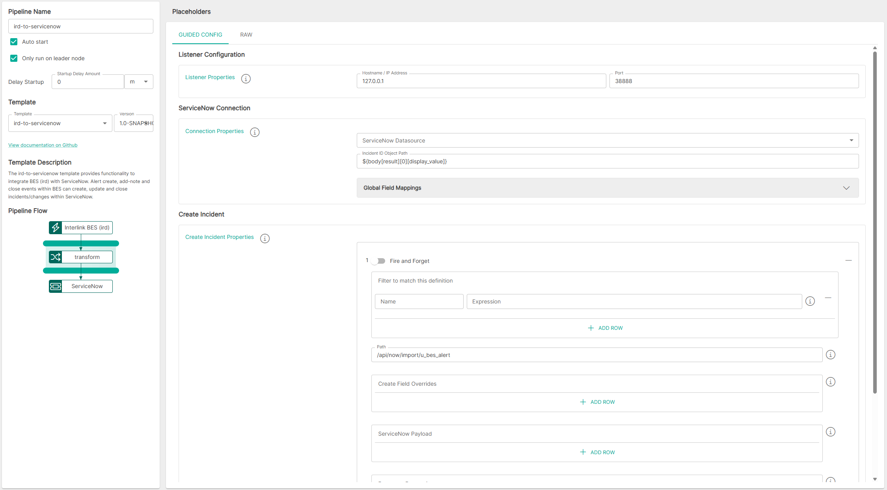
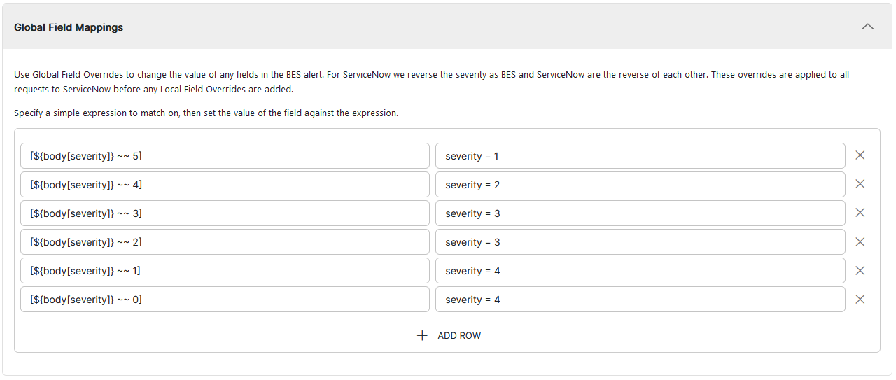

<p align="center">

</p>
<br><br>

# BES IRD to ServiceNow (ird-to-servicenow v1.0)

**Important:** _These instructions assume you have Integration Hub v2.2+ installed_

- For help installing [Integration Hub](https://docs.interlinksoftware.com/ih/latest/index.html), see the [Installation Guide](https://docs.interlinksoftware.com/ih/latest/install/install_overview.html).

## Overview

The ird-to-servicenow template enables the integration of BES (ird) with ServiceNow. It allows alert creation, note addition, and closure events within BES to correspondingly create, update, and close incidents or changes within ServiceNow

## Prerequisites

Before creating the pipeline you will need to have completed / addressed the following:

- Configured a UserAO in ASI that triggers the `createIncident` utility -- More information can be found on our documentation site: [Configure User Automated Operations](https://docs.interlinksoftware.com/asi/2.7.13/configuration/automation/automation.html)

- Configured a Datasource within Integration Hub that connects to your ServiceNow environment

- Ensured that the template is installed and is available within the user interface. Install directly from github or transfer the template to your Integration Hub server.

  - Installing directly from Github:

    ```
    ih-cli template import https://raw.githubusercontent.com/interlinksoftware/integrationhub/main/templates/ird-to-servicenow/1.0/ird-to-servicenow~1.0.yml
    ```

  - Install from local file. Place the template file in the `integration-hub/config/templates` directory, then run:

    ```
    ih-cli template import <path to template file>
    ```

  **Note:** _You will need to reload the configuration after importing a template before you can use it, to do this run:_

  ```
  ih-cli config reload
  ```

## Configuration

From the Pipelines section of the user interface you can create, update and delete pipelines. The following properties can be set for your pipeline.



### ServiceNow Connection

| Parameter      | Type                                                          |
| :------------- | :------------------------------------------------------------ |
| `ServiceNow Datasource`     | Datasource that contains the connection details for your ServiceNow environment                 |
| `Incident ID Object Path`         | Simple Expression, defining the JSONPath to the Incident ID in the ServiceNow response |

<br />

#### Global Field Mappings

Use Global Field Overrides to change the value of any fields in the BES alert. For ServiceNow we reverse the severity as BES and ServiceNow are the reverse of each other. These overrides are applied to all requests to ServiceNow before any Local Field Overrides are added.



### Create Incident

| Field  | Description                                                          |
| :--------- | :------------------------------------------------------------ |
| `Toggle Pre-process Filters` | Toggle to enable / disable pre-process filters<br></br>When enabled, further processing is prevented if the defined expression(s) **DO NOT** match<br></br><table><tr><th>Field</th><th>Description</th></tr><tr><td>Name</td><td>The name of the filter to help identify its purpose</td></tr><tr><td>Expression</td><td>The expression, written in Apache Camel Simple Language that matches against the incoming message</td></tr></table> |
| `IRD Configuration Filename` | Name of the IRD configuration file used when `createIncident` is ran<br></br>This also acts as a filter, in that the incoming message will only be processed if the name of the ird config file within the incoming message matches the value defined for this field<br></br>Must include the file extension i.e - `irdSN.cfg` |
| `Path`     | The endpoint in ServiceNow for creating incidents        |
| `Create Field Overrides` | Use Create Field Overrides to override the value of any fields in the BES alert when creating an incident |
| `ServiceNow Payload` | The fields and values you wish to send to ServiceNow |

### Logging

| Field        | Description                                                                                                                                              |
| :--------------- | :------------------------------------------------------------------------------------------------------------------------------------------------ |
| `logReceived`    | If enabled all messages received will be captured, the maximum number of entries is controlled by the `uiMessageLimit` property                   |
| `logDropped`     | If enabled all messages dropped will be captured, the maximum number of entries is controlled by the `uiMessageLimit` property                    |
| `logProcessed`   | If enabled all messages processed will be captured, the maximum number of entries is controlled by the `uiMessageLimit` property                  |
| `logSuccess`     | If enabled all messages that were successfully sent will be captured, the maximum number of entries is controlled by the `uiMessageLimit` property |
| `logFailed`      | If enabled all messages that have failed will be captured, the maximum number of entries is controlled by the `uiMessageLimit` property           |
| `uiMessageLimit` | Specifies the maximum number of messages to store for this pipeline, the default is `200`                                                         |

### Example

Provided below is a sample pipeline configuration for your reference when setting up your own pipeline:

```yaml
app:
  pipelines:
    alert-to-incident:
      enabled: true
      steps:
      - method: pipeline-template
        ref: ird-to-servicenow~1.0
        properties:
          globalFieldOverrides:
            '[${body[severity]} ~~ 5]': severity = 1
            '[${body[severity]} ~~ 4]': severity = 2
            '[${body[severity]} ~~ 3]': severity = 3
            '[${body[severity]} ~~ 2]': severity = 3
            '[${body[severity]} ~~ 1]': severity = 4
            '[${body[severity]} ~~ 0]': severity = 4
          serviceNowInstance: servicenow
          incidentPayload:
          - irdConfig: irdSN.cfg
            togglePreprocessFilter: true
            preprocessFilters:
            - trigger: Process if alert is not in maintenance
              expression: ${exchangeProperty.loadedAlert[sysmntcls]} == ''
            - trigger: Process if occurences equals 1
              expression: ${exchangeProperty.loadedAlert[occurrences]} == 1
            - trigger: Process if eId is equal to alertId
              expression: ${exchangeProperty.loadedAlert[eid]} == ${exchangeProperty.alertId}
            fieldOverrides:
              '[${body[u_business_service]} regex ''(?s)(.*?)'']': u_business_service
                = ExampleAirline
              '[${body[u_summary]} == ''null'']': u_summary = Random description
            path: /api/now/import/u_bes_alert
            payload:
              alertid: ${body[alertid]}
              domaintext: ${body[text]}
              u_description: ${body[text]}
              severity: ${body[severity]}
              u_alertid: ${body[alertId]}
              u_category: Alert
              u_department: BES
              u_item: ${body[origobject]}
              u_login: BES User
              u_site: ${body[location]}
              u_source: Automatic
              u_status: New
              u_subcategory: BES
              u_submitted_by: BES User
              u_summary: ${body[text]}
              u_business_service: ${body[_servicemodel]}
              u_service_offering: ${body[_serviceoffering]}
```