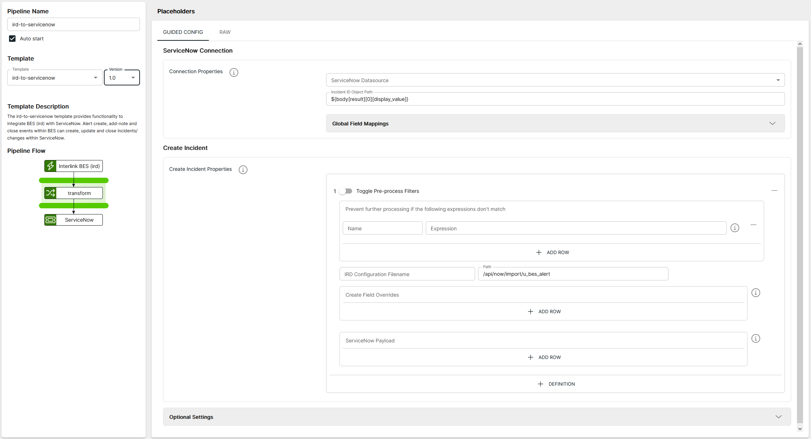
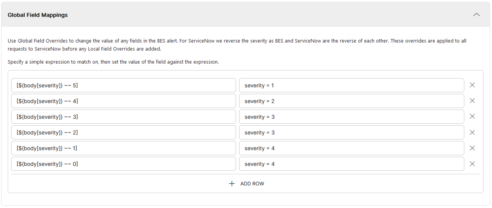

<p align="center">

</p>
<br><br>

# BES IRD to ServiceNow (ird-to-servicenow v1.1)

**Important:** _These instructions assume you have Integration Hub v2.2+ installed_

- For help installing [Integration Hub](https://docs.interlinksoftware.com/ih/latest/index.html), see the [Installation Guide](https://docs.interlinksoftware.com/ih/latest/install/install_overview.html).

## What's new in ird-to-servicenow v1.1

| Enhancement or Feature                                                                         | ID     |
| :--------------------------------------------------------------------------------------------- | :----- |
| Add error handling for when we build the payload object so we can catch and log out any errors | IH-833 |
| Extend XML escape logic to ignore CDATA blocks that may contain URLs                           | IH-831 |

## Overview

The ird-to-servicenow template enables the integration of BES (ird) with ServiceNow. It allows alert creation, note addition, and closure events within BES to correspondingly create, update, and close incidents or changes within ServiceNow

## Prerequisites

Before creating the pipeline you will need to have completed / addressed the following:

- Configured a UserAO in ASI that triggers the `createIncident` utility -- More information can be found on our documentation site: [Configure User Automated Operations](https://docs.interlinksoftware.com/asi/2.7.13/configuration/automation/automation.html)

- Configured a Datasource within Integration Hub that connects to your ServiceNow environment

- Ensured that the template is installed and is available within the user interface. Install directly from github or transfer the template to your Integration Hub server.

  - Installing directly from Github:

    ```
    ih-cli template import https://raw.githubusercontent.com/interlinksoftware/integrationhub/main/templates/ird-to-servicenow/1.1/ird-to-servicenow~1.1.yml
    ```

  - Install from local file. Place the template file in the `integration-hub/config/templates` directory, then run:

    ```
    ih-cli template import <path to template file>
    ```

  **Note:** _You will need to reload the configuration after importing a template before you can use it, to do this run:_

  ```
  ih-cli config reload
  ```

## Configuration

From the Pipelines section of the user interface you can create, update and delete pipelines. The following properties can be set for your pipeline.



### Listener Configuration

The pipeline will listen for incoming messages that have been generated via the createIncident utility

The following properties can be specified when configuring the listener:

| Property                | Description                                                       |
| :---------------------- | :---------------------------------------------------------------- |
| `Hostname / IP Address` | The hostname / ip address you want to configure for this listener |
| `Port`                  | The number of the port you wish this pipeline to listen on        |

<br>

> [!IMPORTANT]
> The `Hostname / IP Address` and `Port` need to match what has been configured in your `irdSN.cfg` file i.e:

```bash
config=irdSN.cfg

ServerLocation=localhost
ServerPort=38888
ISSdebug=1

IncidentRetryAttempts=1
ISSassign=1
ISSclose=1
ISSnote=1

alertId=[alertId]
```

### ServiceNow Connection

| Parameter                 | Type                                                                                   |
| :------------------------ | :------------------------------------------------------------------------------------- |
| `ServiceNow Datasource`   | Datasource that contains the connection details for your ServiceNow environment        |
| `Incident ID Object Path` | Simple Expression, defining the JSONPath to the Incident ID in the ServiceNow response |

<br />

#### Global Field Mappings

Use Global Field Overrides to change the value of any fields in the BES alert. For ServiceNow we reverse the severity as BES and ServiceNow are the reverse of each other. These overrides are applied to all requests to ServiceNow before any Local Field Overrides are added.



### Create Incident

The properties below define the structure and content of the payload sent to ServiceNow. Use these to specify which fields to populate and how values are mapped from the incoming alert data.

| Property                 | Description                                                                                                                                                                                                                                                                                                  |
| :----------------------- | :----------------------------------------------------------------------------------------------------------------------------------------------------------------------------------------------------------------------------------------------------------------------------------------------------------- |
| `Fire and Forget`        | When **enabled**, the action is performed in ServiceNow (such as creating, updating, or closing an incident) but does not update the corresponding alert in BES.<br/><br/>When **disabled**, the action is performed in ServiceNow and the alert in BES is updated accordingly (e.g., with the incident ID). |
| `Filter`                 | Expressions that can be set to prevent further processing of an incoming alert                                                                                                                                                                                                                               |
| `Path`                   | ServiceNow endpoint that the payload will be sent to (_default: /api/now/import/u_bes_alert_)                                                                                                                                                                                                                |
| `Create Field Overrides` | Use Create Field Overrides to override the value of any fields in the BES alert when creating an incident                                                                                                                                                                                                    |
| `ServiceNow Payload`     | Define the fields and values you wish to send to ServiceNow                                                                                                                                                                                                                                                  |
| `Response Processing`    | Specify the alert fields and the corresponding values from the ServiceNow response returned after creating an incident, to update the fields in the BES alert                                                                                                                                                |

### Optional Settings

| Property           | Description                                                                                                                                        |
| :----------------- | :------------------------------------------------------------------------------------------------------------------------------------------------- |
| `UI Message Limit` | Limit of failed/dropped/success/processed/received messages to display on the UI                                                                   |
| `logReceived`      | If enabled all messages received will be captured, the maximum number of entries is controlled by the `uiMessageLimit` property                    |
| `logDropped`       | If enabled all messages dropped will be captured, the maximum number of entries is controlled by the `uiMessageLimit` property                     |
| `logProcessed`     | If enabled all messages processed will be captured, the maximum number of entries is controlled by the `uiMessageLimit` property                   |
| `logSuccess`       | If enabled all messages that were successfully sent will be captured, the maximum number of entries is controlled by the `uiMessageLimit` property |
| `logFailed`        | If enabled all messages that have failed will be captured, the maximum number of entries is controlled by the `uiMessageLimit` property            |

### Pipeline Example

Provided below is a sample pipeline configuration for your reference when setting up your own pipeline:

```yaml
app:
  pipelines:
    ird-to-servicenow-pipeline:
      steps:
        - method: pipeline-template
          ref: ird-to-servicenow~1.0
          properties:
            host: 127.0.0.1
            port: "38888"
            serviceNowInstance: servicenow
            incidentIdObjectPath: ${body[result][0][display_value]}
            incidentPayload:
              - fireAndForget: ""
                preprocessFilters:
                  - trigger: New Incident
                    expression:
                      ${exchangeProperty.messageType} == "I" && ${exchangeProperty.irdConfig}
                      ~~ "irdSN.cfg" && ${body[occurrences]} >= 1
                path: /api/now/import/u_bes_alert
                localFieldOverrides:
                  "[${body[severity]} ~~ 4]": test_value = 9999 # Example of setting a custom value to add to the payload based on an expression i.e (If the incoming alert serverity contains 4)
                payload:
                  alertid: ${exchangeProperty[alertId]}
                  domaintext: ${body[text]}
                  u_description: ${body[text]}
                  severity: ${body[severity]}
                  u_alertid: ${exchangeProperty[alertId]}
                  u_category: Alert
                  u_department: BES
                  u_item: ${body[_origobject]}
                  u_login: BES User
                  u_name: BES User
                  u_site: ${body[_location]}
                  u_source: Automatic
                  u_status: New
                  u_subcategory: BES
                  u_submitted_by: BES User
                  u_summary: ${body[text]}
                  u_business_service: ${body[_servicemodel]}
                  u_service_offering: ${body[_serviceoffering]}
                  test_value: ${body[test_value]}
                  random_value: ${body[random]} defaultValue This Default # Example of setting a default value if the initial values returns null or empty
                responseProcessing:
                  incidentid: ${body[result][0][display_value]}
              - fireAndForget: false
                preprocessFilters:
                  - trigger: Add Note
                    expression: ${exchangeProperty.messageType} == "AN"
                localFieldOverrides: ""
                payload:
                  alertid: ${exchangeProperty[alertId]}
                  notes: ${exchangeProperty.note}
                path: /api/now/import/u_bes_alert
              - fireAndForget: false
                preprocessFilters:
                  - trigger: Close
                    expression: ${exchangeProperty.messageType} == "C"
                localFieldOverrides: ""
                payload:
                  notes:
                    Alert ${exchangeProperty[alertId]} closed in BES. (BES Alert
                    assigned to [${body[currentOperator]}]
                  u_status: Alert Closed
                  alertid: ${exchangeProperty[alertId]}
                path: /api/now/import/u_bes_alert
              - fireAndForget: false
                preprocessFilters:
                  - trigger: Assign
                    expression: ${exchangeProperty.messageType} == "A"
                localFieldOverrides: ""
                payload:
                  alertid: ${exchangeProperty[alertId]}
                  u_service_offering: ${body[_serviceoffering]}
                  u_business_service: ${body[_servicemodel]}
                path: /api/now/import/u_bes_alert
      enabled: true
```
