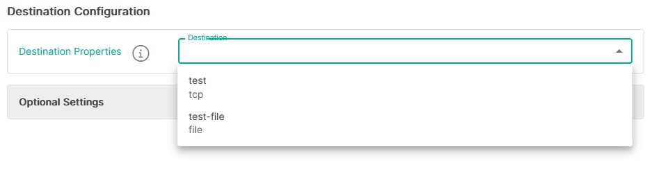

<p align="center">
  
</p>

# Message Cache Consumer to TCP Listener (`message-cache-consumer-to-tcp` v1.0)

> **Important**  
> This template requires Integration Hub `2.4.0` or later.

For help installing Integration Hub, see the [Integration Hub documentation](https://docs.interlinksoftware.com/ih/latest/index.html) and [Installation Guide](https://docs.interlinksoftware.com/ih/latest/install/install_overview.html).

## Overview

The `message-cache-consumer-to-tcp` template consumes messages from an ISS Message Cache topic, optionally filters and transforms them, and sends the results to one or more Integration Hub output targets.

The Message Cache connection uses Kafka with `SASL_SSL`, the `PLAIN` SASL mechanism, and the configured Integration Hub SSL context.

## Prerequisites

Before creating a pipeline, ensure that you have:

- An accessible ISS Message Cache cluster and an existing topic to consume.
- The broker addresses, username, password, and consumer group name supplied by the Message Cache administrator.
- An Integration Hub SSL context that trusts the Message Cache brokers. The template defaults to `#IssSslConfig`.
- At least one [output target](../#defining-an-output-target) for processed messages.
- The template installed and available in the Integration Hub user interface.

## Install the Template

### Option 1: Install Directly from GitHub

```bash
ih-cli template import https://raw.githubusercontent.com/interlinksoftware/integrationhub/main/templates/message-cache-consumer-to-tcp/1.0/message-cache-consumer-to-tcp~1.0.yml
```

### Option 2: Install from a Local File

Place `message-cache-consumer-to-tcp~1.0.yml` in the `integration-hub/config/templates` directory, then run:

```bash
ih-cli template import <path-to-template>/message-cache-consumer-to-tcp~1.0.yml
```

After either installation method, reload the configuration:

```bash
ih-cli config reload
```

## Processing Flow

For each consumed message, the pipeline performs these operations in order:

1. Receives the message from the configured topic.
2. Applies throttling using the configured count and period.
3. Captures the message's Kafka metadata and writes the received-message log when enabled.
4. Applies matching pre-process header rules.
5. Runs regular-expression replacements in their configured order.
6. Optionally escapes unescaped double quotes in an embedded XML element.
7. Decompresses the body when `Content-Encoding` is `gzip` or `application/gzip`.
8. Parses the body based on `Content-Type`.
9. Applies the allow list, then the deny list.
10. Selects a matching filter, splits and formats the message, and routes it to its destinations.

## Message Cache Data Source

| Property                                | Required | Default         | Description                                                                                                                                                                                    |
| --------------------------------------- | :------: | --------------- | ---------------------------------------------------------------------------------------------------------------------------------------------------------------------------------------------- |
| `Message Cache Brokers`                 |   Yes    | —               | Comma-separated broker list in `host:port` format, for example `broker1:9092,broker2:9092`.                                                                                                    |
| `Topic Name`                            |   Yes    | —               | Existing Message Cache topic from which messages are consumed.                                                                                                                                 |
| `Message Cache Username`                |   Yes    | —               | Username used for SASL authentication.                                                                                                                                                         |
| `Message Cache Password`                |   Yes    | —               | Password used for SASL authentication. The template stores this as an encrypted value.                                                                                                         |
| `Group Name`                            |   Yes    | —               | Kafka consumer group ID. Consumers that use the same group share the topic's partitions. Use a distinct group when this pipeline must receive every message independently of another consumer. |
| `SSL Context Parameters`                |    No    | `#IssSslConfig` | Integration Hub SSL context used for the TLS connection.                                                                                                                                       |
| `Regular Expression list (apply regex)` |    No    | —               | Ordered list of regex pattern and replacement pairs applied to the incoming body before parsing.                                                                                               |
| `Embedded XML Root Element`             |    No    | —               | Root element name of XML embedded in a JSON string whose unescaped double quotes must be escaped before JSON parsing. Enter the element name without angle brackets.                           |

The consumer copies the Kafka topic, group name, partition, offset, and key into message headers named `topic`, `groupName`, `partition`, `offset`, and `key`. These values can be included in output or referenced during processing.

## Input Data Types

The message's `Content-Type` header determines how the body is parsed.

| `Content-Type` contains | Processing                                                    |
| ----------------------- | ------------------------------------------------------------- |
| `json`                  | Parse as JSON. A JSON-encoded string is parsed a second time. |
| `xml`                   | Parse as XML.                                                 |
| `yaml`                  | Parse as YAML.                                                |

JSON, XML, and YAML bodies receive a `correlationId` derived from the Integration Hub exchange ID. For a top-level JSON array, the ID is added to each object in the array. Messages with an unrecognised or missing content type are logged as dropped and are not sent to a destination.

If the `Content-Encoding` header is `gzip` or `application/gzip`, the body is decompressed before its data type is parsed.

## Destination Configuration

Select one or more output targets to receive processed messages. These are the global destinations for the pipeline. A filter can also select additional destinations and can decide whether its output is sent to the global destinations.



## Optional Settings

### Field and Message Limits

| Property        | Default | Description                                                          |
| --------------- | ------- | -------------------------------------------------------------------- |
| `Field Limit`   | `256`   | Maximum number of characters allowed in each formatted field.        |
| `Message Limit` | `4096`  | Maximum number of characters allowed in the final formatted message. |

### Expression Syntax

Pre-process headers, allow and deny lists, filters, and destination filters use Integration Hub simple expressions in this form:

```text
field operator value
```

Use `${bodyAs(String)}` for the entire body. For a parsed field, use dot notation such as `${body.username}` or bracket notation such as `${body[username]}`.

| Operator    | Description                          |
| ----------- | ------------------------------------ |
| `==`        | Equals.                              |
| `=~`        | Equals, case-insensitive.            |
| `!=`        | Does not equal.                      |
| `!=~`       | Does not equal, case-insensitive.    |
| `contains`  | Contains a string.                   |
| `!contains` | Does not contain a string.           |
| `regex`     | Matches a regular expression.        |
| `!regex`    | Does not match a regular expression. |
| `&&`        | Combines expressions with AND.       |
| `\|\|`      | Combines expressions with OR.        |

Examples:

| Expression                                                    | Description                                                     |
| ------------------------------------------------------------- | --------------------------------------------------------------- |
| `${bodyAs(String)} regex '(?s)(.*?)'`                         | Matches any string, including multiline content.                |
| `${bodyAs(String)} =~ 'this' && ${bodyAs(String)} !=~ 'that'` | Matches `this` but not `that`, case-insensitively.              |
| `${body.username} == 'ppadmin'`                               | Matches when `username` is `ppadmin`.                           |
| `${body.username} != null`                                    | Matches when `username` is present.                             |
| `${body.origindate} == ${date:now:yyyyMMdd}`                  | Matches when `origindate` is today's date in `yyyyMMdd` format. |

### Pre-process Headers

Pre-process header rules set one or more headers when their expression matches. They run before regex replacement and body parsing, so they can be used to supply or correct `Content-Type` and `Content-Encoding`.

| Property     | Description                                                        |
| ------------ | ------------------------------------------------------------------ |
| `Expression` | Expression evaluated against the incoming message.                 |
| `Headers`    | Map of header names to values applied when the expression matches. |

Example:

```yaml
preprocessHeaders:
  - expression: ${bodyAs(String)} regex '^\\s*[\\{\\[]'
    headers:
      Content-Type: application/json
```

### Regular-expression Replacements

Each configured replacement is applied to the result of the previous replacement before the body is parsed.

```yaml
regexList:
  - pattern: "(?i)apple"
    replacement: orange
  - pattern: '\\s+$'
    replacement: ""
```

Common examples:

| Purpose                      | Pattern       | Replacement      |
| ---------------------------- | ------------- | ---------------- |
| Escape backslashes           | `\\`          | `\\\\`           |
| Remove text before `<alert>` | `^.*?<alert>` | `<alert>`        |
| Remove trailing whitespace   | `\s+$`        | An empty string. |

Patterns use Java regular-expression syntax. Invalid expressions cause message processing to fail.

### Embedded XML Escaping

Use `Embedded XML Root Element` when a JSON message contains an XML block with unescaped double quotes. For a value of `alert`, the pipeline finds the first `<alert>...</alert>` block and escapes double quotes that are not already escaped.

If the configured element cannot be found, the message is logged as failed and processing stops.

### Allow and Deny Lists

The allow list is evaluated before the deny list:

- If an allow list is configured, a message proceeds when at least one allow expression matches.
- If no allow expression matches, the message is logged as dropped.
- If any deny expression matches, the message is logged as dropped even if it passed the allow list.
- If a list is not configured, that list does not restrict processing.

```yaml
allowList:
  - ${body.environment} == 'production'
denyList:
  - ${body.maintenance} == 'true'
```

### Filters

Filters control transformation, splitting, nested-field handling, and destination routing. The pipeline uses the first matching filter. If no filter matches, it uses the default format `${auto}` and split expression `${body}`.

| Property              | Default   | Description                                                                      |
| --------------------- | --------- | -------------------------------------------------------------------------------- |
| `Expression`          | —         | Determines whether the filter applies.                                           |
| `Format`              | `${auto}` | Output template applied to each split message.                                   |
| `Split`               | `${body}` | Expression that selects the collection or value to process.                      |
| `JSON Fields`         | —         | Body fields whose string values should be parsed as JSON before formatting.      |
| `XML Fields`          | —         | Body fields whose string values should be parsed as XML before formatting.       |
| `Field to Map`        | —         | Fields containing pipe-delimited `key = value` pairs for use in a custom format. |
| `Filter destinations` | —         | Conditional destinations for this filter.                                        |

#### Format

Use `${auto}` to flatten the parsed message automatically, or create a custom format by referencing body fields.

Given:

```json
{
  "user": {
    "name": "ppadmin",
    "group": "ppusers"
  },
  "origindate": "2026-08-28 12:01:34"
}
```

A custom format of:

```text
UserAlert datetime = ${body.origindate} | name = ${body.user.name} | group = ${body.user.group} |
```

produces:

```text
UserAlert datetime = 2026-08-28 12:01:34 | name = ppadmin | group = ppusers |
```

Set `Include Headers in Processed Message` to include message headers in formatted output. `Newline Placeholder` replaces newline characters (default: one space), and `Blank Placeholder` replaces blank values (default: `N/A`).

#### Split

The default `${body}` expression sends each item of a top-level array as a separate message. To split a nested array, specify its path. For this input:

```json
{
  "events": [{ "id": 1 }, { "id": 2 }]
}
```

use:

```text
${body.events}
```

This produces two independently formatted destination messages.

#### Stringified JSON and XML Fields

Add a field name to `JSON Fields` when the field contains a JSON document encoded as a string. The decoded object replaces that string and its child values can then be referenced by the format.

Use `XML Fields` similarly for stringified XML. The v1.0 XML unpacking logic expects an `<alert>` element in the stringified content.

#### Field to Map

This option is intended for fields that contain pipe-delimited key-value pairs:

```text
className = NOTIFY_EVENT | hostName = server01 | severity = 5 |
```

Parsed values are available under `${exchange.properties.parsedFields}`, for example:

```text
Alert | className = ${exchange.properties.parsedFields.className} | hostName = ${exchange.properties.parsedFields.hostName} |
```

> **Version 1.0 limitation**  
> The template implementation currently parses fields named `raw` and `otherField`; values entered in `Field to Map` do not change those field names.

#### Filter Destinations

Each filter destination contains an expression, one or more destination names, and `Send to global destination`.

```yaml
destinationServers:
  - TCP_PRIMARY
filters:
  - expression: ${bodyAs(String)} regex '(?s)(.*?)'
    format: ${auto}
    split: ${body}
    destinations:
      - expression: ${body.severity} == 'critical'
        destinationNames:
          - TCP_CRITICAL
        sendToGlobalDestination: false
```

With `sendToGlobalDestination: false`, matching messages go to `TCP_CRITICAL` but not `TCP_PRIMARY`. Set it to `true` to send to both the filter-specific and global destinations. A destination expression of `default` acts as a fallback destination entry.

### Throttling

| Property            | Default | Description                                                     |
| ------------------- | ------- | --------------------------------------------------------------- |
| `Enable Throttling` | `false` | Enables the throttling controls in the pipeline configuration.  |
| `Throttle Count`    | `10`    | Maximum number of messages accepted during one throttle period. |
| `Throttle Period`   | `10s`   | Duration of the throttle window, such as `10s`.                 |

When the limit is exceeded, the pipeline rejects the message rather than waiting for capacity.

### Logging

Logging options write each selected category to both the Integration Hub log file and message database. Files follow the pattern `logs/<pipeline-name>-<yyyymmdd>.<category>`.

| Property           | Default | Description                                                                                                                |
| ------------------ | ------- | -------------------------------------------------------------------------------------------------------------------------- |
| `logReceived`      | `true`  | Captures messages as received from Message Cache.                                                                          |
| `logDropped`       | `true`  | Captures messages rejected because of data type, allow-list, or deny-list processing.                                      |
| `logProcessed`     | `true`  | Captures formatted messages before destination routing.                                                                    |
| `logSuccess`       | `true`  | Captures messages successfully sent to a destination.                                                                      |
| `logFailed`        | `true`  | Captures messages that fail during connection or processing.                                                               |
| `UI Message Limit` | `200`   | Maximum number of received, dropped, processed, successful, and failed entries retained for display in the user interface. |

## Troubleshooting

| Symptom                                                | Checks                                                                                                                           |
| ------------------------------------------------------ | -------------------------------------------------------------------------------------------------------------------------------- |
| Pipeline cannot connect to Message Cache               | Verify every `host:port`, the credentials, broker reachability, and that the selected SSL context trusts the broker certificate. |
| Pipeline connects but receives no messages             | Verify the topic name and consumer group. Another consumer with the same group may own the relevant partition.                   |
| Message is logged as dropped with an unknown data type | Ensure the producer supplies a supported `Content-Type`, or add a pre-process header rule to set it.                             |
| JSON parsing fails for a message containing XML        | Configure `Embedded XML Root Element` with the XML element name, or correct escaping at the producer.                            |
| Expected destination receives no output                | Check the allow list, deny list, filter expression, destination expression, and `Send to global destination` setting.            |
