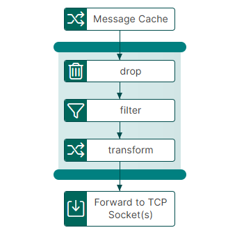
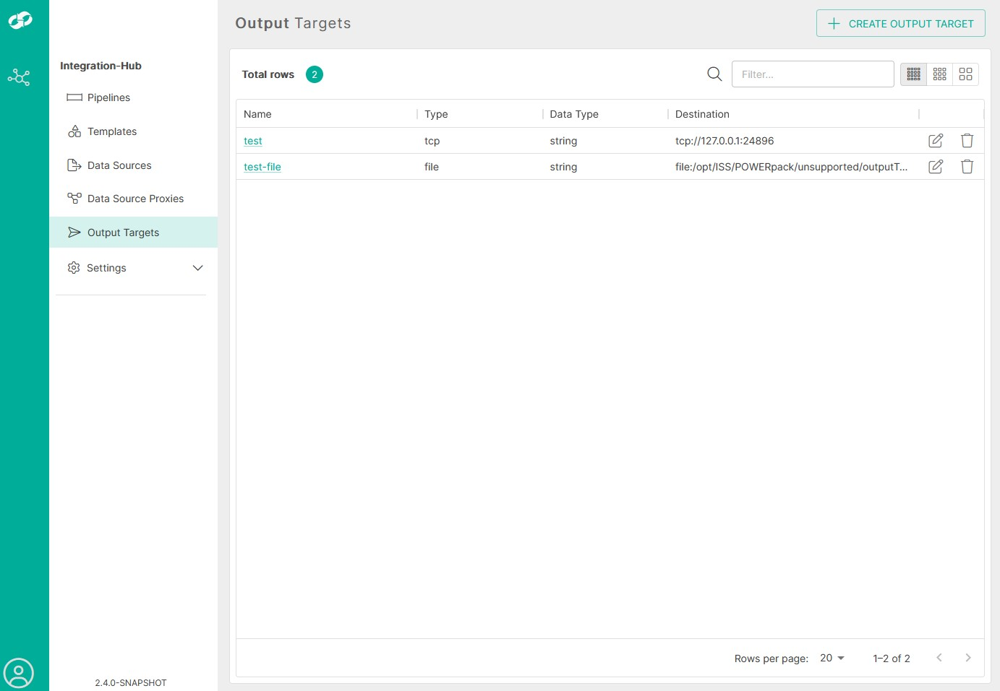
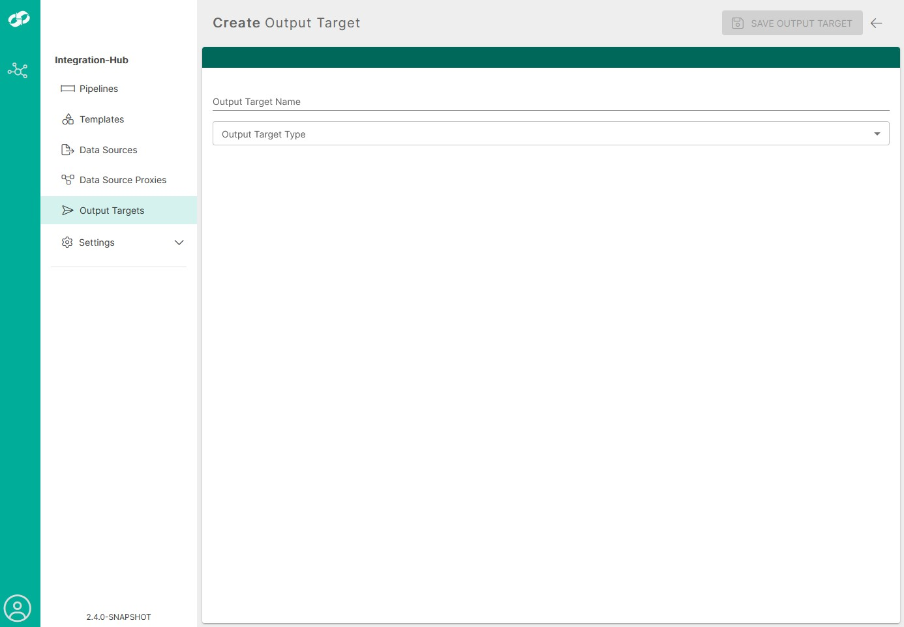
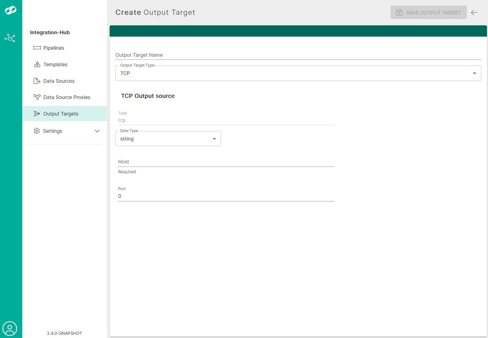

# message-cache-consumer-to-tcp Template

The `message-cache-consumer-to-tcp` template consumes messages from an ISS Message Cache topic, optionally filters and transforms them, and sends the resulting messages to one or more Integration Hub output targets.

  

## Available Versions

| Version | Minimum Integration Hub version | Documentation |
| ------- | ------------------------------- | ------------- |
| `1.0`   | `2.4.0`                         | [Configuration and usage](1.0/) |

## What the Template Does

The pipeline:

1. Connects to an ISS Message Cache topic using Kafka `SASL_SSL` with the `PLAIN` SASL mechanism.
2. Receives and records Kafka message metadata, including the topic, consumer group, partition, offset, and key.
3. Optionally sets headers, applies regular-expression replacements, and escapes embedded XML.
4. Decodes gzip-compressed data and parses JSON, XML, or YAML according to the message's `Content-Type` header.
5. Applies allow and deny rules, filters, splitting, and output formatting.
6. Sends processed messages to the configured output target or targets.

## Prerequisites

Before using the template, configure:

- An accessible ISS Message Cache cluster, topic, username, password, and consumer group name.
- An SSL context in Integration Hub for the Message Cache TLS connection. The default reference is `#IssSslConfig`.
- At least one output target for the processed messages.

For installation instructions and a complete property reference, see the [version 1.0 documentation](1.0/).

## Defining an Output Target

Open **Output Targets** from the Integration Hub navigation menu, then select **CREATE OUTPUT TARGET**.

 

The template uses Integration Hub destination references, so it can send to any output-target type supported by the installed Integration Hub version. For a TCP destination, configure the following properties:

| Property             | Description |
| -------------------- | ----------- |
| `Output Target Name` | Unique name used to select the target in the pipeline configuration. |
| `Data Type`          | Data type expected by the target. |
| `Host`               | Hostname or IP address of the TCP listener. |
| `Port`               | Port on which the TCP listener accepts connections. |
