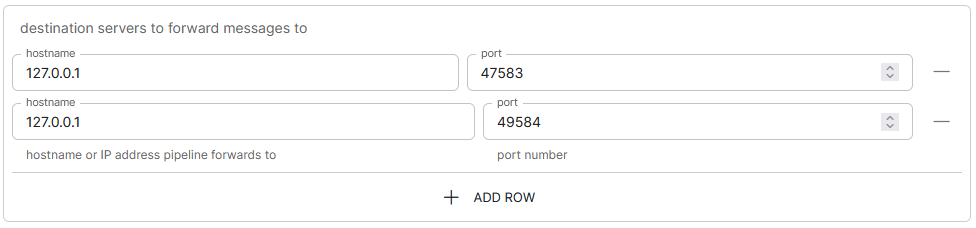

# rabbitmq-to-tcp v1.0

## Release Notes

| TicketId | Description |
| -------- | ----------- |

---

## Creating the Pipeline

Login to the Integration Hub UI. Select the `Templates` menu option on the left, and click the `CREATE PIPELINE` button next to the rabbitmq-to-tcp template.

### Source

For the `Source`, you will require the following connection details for your RabbitMQ environment:

<p align="center">

</p>

| Property             | Default | Description                                                  |
| -------------------- | ------- | ------------------------------------------------------------ |
| **\*_vhost_**        | /       | The RabbitMQ Virtual Host for the channel                    |
| **\*_exchangeName_** |         | The exchange the queue will be bound to                      |
| **\*_hostname_**     |         | Hostname or IP address of the RabbitMQ Server                |
| **\*_portNumber_**   |         | Port number of the AMQP endpoint in RabbitMQ (default: 5652) |
| **\*_queue_**        |         | The queue in RabbitMQ to receive messages from               |
| _username_           |         | Username in case of authenticated access                     |
| _password_           |         | Password in case of authenticated access                     |

#### preprocessHeaders

The preprocessHeaders allow you to set a list of expressions and headers to manipulate incoming data before it is processed. For example, if you were to send gzip compressed JSON into RabbitMQ, for the message to be processed correctly, you would have to define the following configuration:

<p align="center">

</p>

The `Content-Encoding` header will first instruct the template to unzip the contents of the gzip that we want to read from our RabbitMQ queue, then the `Content-Type` header will tell the template that the content of the file is JSON, therefore should be processed as JSON.

### Process

The `Process` section allows for you to allow/deny, filter/format and replace newline/blank characters within the incoming message

#### Allow / Deny List

The Allow/Deny lists allow you to define expressions which determine whether an incoming message will be processed and sent to BES, or dropped where any further processing will be cancelled

Let's take the following JSON message for example:

```
{
  "hostname": "test.domain.com"
  "type": "Hardware"
  "hardware": "CPU"
  "usage": 100
}
```

To allow an incoming message, we can create an expression that says "_If `hostname` is `test.domain.com` and `hardware` is `CPU` and `usage` is greater than or equal to `80`, **process** this message_"

Below is an example of how the expression would look in the UI:

<p align="center">

</p>

To deny an incoming message, We can create an expression that says "_If `hostname` is `test.domain.com` and `hardware` is `CPU` and `usage` is less than or equal to `30`, **don't process** this message_"

Below is an example of how the expression would look in the UI:

<p align="center">

</p>

#### Filter and Format

The filtering and formatting logic allows us to manipulate how we want the alert to look when it gets sent to BES. Take the following JSON for example:

```
{
  "hostname": "test.domain.com"
  "type": "Hardware"
  "hardware": "CPU"
  "usage": 100
  "text": "This is some random text"
}
```

By default, the rabbitmq-to-tcp template uses `${auto}` formatting, which will result in a alert similar to the following:

```
hostname = test.int-link.com | type = Hardware | hardware = CPU | usage = 30 | text = This is some random text......
```

But what if we wanted to remove the text field `This is some random text` from our alert?

This can be done by creating our own custom filter and format logic to strip any unwanted data from an incoming message. For example, in the UI we can define the following logic that will strip the unwanted text field:

<p align="center">

</p>

### Target

#### Destination Servers

Destination servers in this case are the message channel(s) that you wish to send alert to. For example

`hostname`: Hostname of the BES Server where the message channel is running on

`port`: Port number that the message channel is listening on

We can configure multiple destination servers, or configure to send to multiple message channels. For example:

<p align="center">

</p>

## Pipeline Properties

| Property                   | Default | Description                                                                                                                                             |
| -------------------------- | ------- | ------------------------------------------------------------------------------------------------------------------------------------------------------- |
| **\*_pipelines: "[xxx]"_** |         | Pipeline name - must match the newly created pipeline yaml file                                                                                         |
| **\*_ref_**                |         | Reference to the template including version                                                                                                             |
| **\*_vhost_**              | /       | The RabbitMQ Virtual Host for the channel                                                                                                               |
| **\*_exchangeName_**       |         | The exchange the queue will be bound to                                                                                                                 |
| **\*_hostname_**           |         | Hostname or IP address of the RabbitMQ Server                                                                                                           |
| **\*_portNumber_**         |         | Port number of the AMQP endpoint in RabbitMQ (default: 5652)                                                                                            |
| **\*_queue_**              |         | The queue in RabbitMQ to receive messages from                                                                                                          |
| _username_                 |         | Username in case of authenticated access                                                                                                                |
| _password_                 |         | Password in case of authenticated access                                                                                                                |
| **\*_destinationServers_** |         | List of servers to send the pipeline output to                                                                                                          |
| _blankPlaceholder_         |         | String to replace blank values with                                                                                                                     |
| _newlinePlaceholder_       |         | String to replace newline character values with                                                                                                         |
| _allowList_                |         | List of logic statements to determine if the request can proceed                                                                                        |
| _denyList_                 |         | List of logic statements to halt the request                                                                                                            |
| _filters_                  |         | List of filters to match and format the data                                                                                                            |
| _preprocessHeaders_        | NOT_SET | List of expressions and headers to manipulate incoming data before it is processed                                                                      |
| _logProcessed_             | true    | To log the data once processed into its final form. _**The received file is logs/<pipeline name>-<yyyymmdd>.processed**_                                |
| _logSuccess_               | true    | To log messages that were successfully sent to the tcp destination, set this to true. _**The success file is logs/<pipeline name>-<yyyymmdd>.success**_ |
| _logReceived_              | true    | To log all received data, set this to true. _**The received file is logs/<pipeline name>-<yyyymmdd>.received**_                                         |
| _logDropped_               | true    | To log all dropped data, set this to true. _**The dropped file is logs/<pipeline name>-<yyyymmdd>.dropped**_                                            |
| _logFailed_                | true    | To log all failed data. _The failed log file is **logs/<pipeline name>-<yyyymmdd>.failed**_                                                             |
| _uiMessageLimit_           | 200     | Limit of failed/success/processed/received messages to display in the UI                                                                                |

**_\*mandatory property_**
