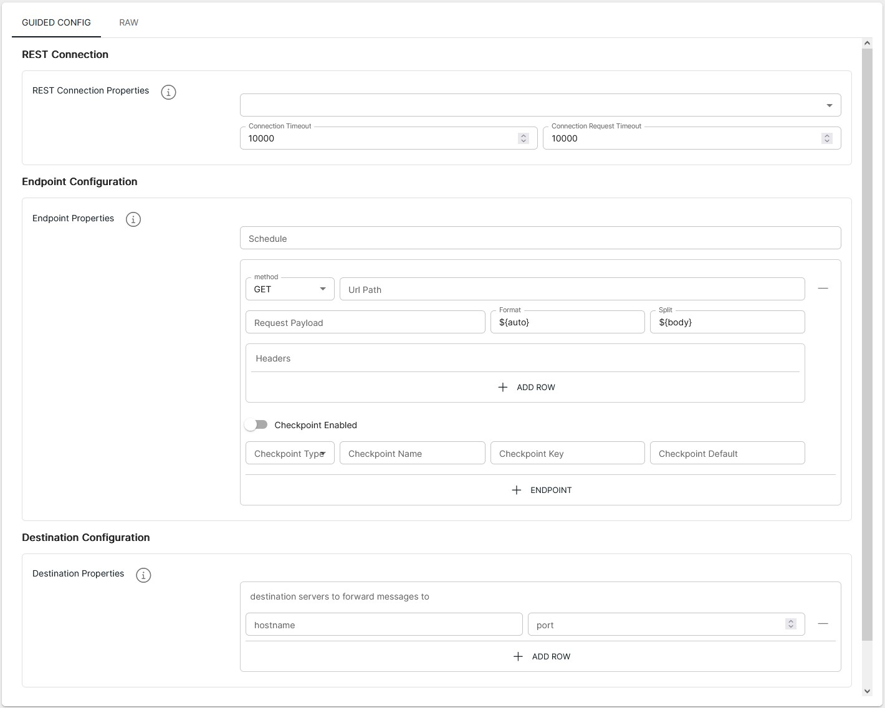

<p align="center">

</p>
<br><br>

# REST to TCP Listener (rest-to-tcp v1.0)

**Important:** _These instructions assume you have Integration Hub v2.2+ installed_

- For help installing [Integration Hub](https://docs.interlinksoftware.com/ih/latest/index.html), see the [Installation Guide](https://docs.interlinksoftware.com/ih/latest/install/install_overview.html).

## Overview

The rest-to-tcp template provides functionality to query, filter/transform and send from HTTP requests to a TCP listener, via an integration-hub pipeline.

## Prerequisites

Before creating the pipeline you will need have the following configured:

- The template is installed and is available within the user interface. Install directly from github or transfer the template to your Integration Hub server.

  - Installing directly from Github:

    ```
    ih-cli template import https://raw.githubusercontent.com/interlinksoftware/integrationhub/main/templates/rest-to-tcp/1.0/rest-to-tcp~1.0.yml
    ```

  - Install from local file. Place the template file in the `integration-hub/config/templates` directory, then run:

    ```
    ih-cli template import <path to template file>
    ```

  **Note:** _You will need to reload the configuration after importing a template before you can use it, to do this run:_

  ```
  ih-cli config reload
  ```

## Configuration

From the Pipelines section of the user interface you can create, update and delete pipelines. The following properties can be set for your pipeline.



### REST Connection

| Property                  | Description                                     |
| :------------------------ | :---------------------------------------------- |
| `Data Source`             | The dataSource for the connection               |
| `Connection Timeout`      | Duration in milliseconds to timeout the request |
| `Connect Request Timeout` | Duration in seconds to stop the request         |

### Endpoint Configuration

| Property             | Description                                                                                                                                                                                                                          |
| :------------------- | :----------------------------------------------------------------------------------------------------------------------------------------------------------------------------------------------------------------------------------- |
| `Schedule`           | The cron string used to specify the frequency of requests to each defined endpoint                                                                                                                                                   |
| `Method`             | Select the HTTP method to use for the REST request                                                                                                                                                                                   |
| `Url Path`           | Specify the Url path, this will be appended to the selected REST Datasource specified                                                                                                                                                |
| `Request Payload`    | Enter any data you want to send in the Body of the REST request                                                                                                                                                                      |
| `Format`             | Expression to use for the transformation of incoming messages                                                                                                                                                                        |
| `Split`              | Expression to use for splitting incoming data into multiple events                                                                                                                                                                   |
| `Checkpoint Enabled` | Toggle to enable / disable checkpointing                                                                                                                                                                                             |
| `Checkpoint Type`    | The type of checkpointing to use. For example:<br /><br />`field (value of a key in the body)`<br /><br />OR<br /><br />`date`                                                                                                       |
| `Checkpoint Name`    | Unique name for checkpointing messages                                                                                                                                                                                               |
| `Checkpoint Key`     | The key from the payload that you want to set as the checkpoint key.<br /><br />If the checkpoint type is `date` the format would be as follows:<br /><br />`# '1970-01-01', '00:00:00'` <br />`key: "''yyyy-MM-dd'', ''hh:mm:ss''"` |
| `Checkpoint Default` | Default value to set if the checkpoint does not exist.<br /><br />This can either be a string, or `now` if the checkpoint type is set to `date`                                                                                      |

### Destination Configuration

| Parameter  | Type                                                          |
| :--------- | :------------------------------------------------------------ |
| `Hostname` | The Hostname / IP of the system where the TCP channel resides |
| `Port`     | The port number that the TCP channel is listening on          |

## Additional Settings

### Logging

| Parameter        | Type                                                                                                                                              |
| :--------------- | :------------------------------------------------------------------------------------------------------------------------------------------------ |
| `logReceived`    | If enabled all messages received will be captured, the maximum number of entries is controlled by the `uiMessageLimit` property                   |
| `logDropped`     | If enabled all messages dropped will be captured, the maximum number of entries is controlled by the `uiMessageLimit` property                    |
| `logProcessed`   | If enabled all messages processed will be captured, the maximum number of entries is controlled by the `uiMessageLimit` property                  |
| `logSuccess`     | If enabled all messages that were successfully sent will be captured, the maximum number of entries is controlled by the `uiMessageLimit` property |
| `logFailed`      | If enabled all messages that have failed will be captured, the maximum number of entries is controlled by the `uiMessageLimit` property           |
| `uiMessageLimit` | Specifies the maximum number of messages to store for this pipeline, the default is `200`                                                         |
