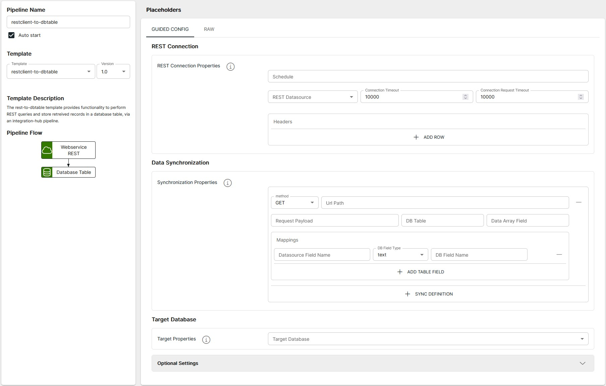

<p align="center">

</p>
<br><br>

# REST Client to Database Table <small>(_restclient-to-dbtable v1.0_)</small>

**Important:** _These instructions assume you have Integration Hub v2.2+ installed_

- For help installing [Integration Hub](https://docs.interlinksoftware.com/ih/latest/index.html), see the [Installation Guide](https://docs.interlinksoftware.com/ih/latest/install/install_overview.html).

## Overview

This template can be used to synchronise the data between the response from a REST API call and a Database Table.

## Prerequisites

Before creating the pipeline you will need have the following configured:

- The template is installed and is available within the user interface. Install directly from github or transfer the template to your Integration Hub server.

  - Installing directly from Github:

    ```
    ih-cli template import https://raw.githubusercontent.com/interlinksoftware/integrationhub/main/templates/restclient-to-dbtable/1.0/restclient-to-dbtable~1.0.yml
    ```

  - Install from local file. Place the template file in the `integration-hub/config/templates` directory, then run:

    ```
    ih-cli template import <path to template file>
    ```

  **Note:** _You will need to reload the configuration after importing a template before you can use it, to do this run:_

  ```
  ih-cli config reload
  ```

## Configuration

From the Pipelines section of the user interface you can create, update and delete pipelines. The following properties can be set for your pipeline.



<br>

### Pipeline Definitions

<table>
  <tr>
    <th>Property</th>
    <th>Description</th>
  </tr>
  <tr>
    <td><code>Cron Schedule</code></td>
    <td>The <a href=http://www.cronmaker.com/>cron</a> expression that defines the execution schedule for this pipeline</td>
  </tr>
  <tr>
    <td><code>REST Datasource</code></td>
    <td>The pre-defined REST datasource to use for querying</td>
  </tr>
  <tr>
    <td><code>Target Database</code></td>
    <td>The pre-defined database that will contain the created table</td>
  </tr>
  <tr>
    <td><code>Request Headers</code></td>
    <td>Specify any request headers that need to be present on the REST API calls</td>
  </tr>
  <tr>
    <td><code>Body Payload</code></td>
    <td>Specify any body data that need to be passed on the REST API calls</td>
  </tr>
</table>

### Data Syncronization

You can specify multiple requests within the one pipeline, to add another request click the **<code>+SYNC DEFINITION</code>** button.

<table>
  <tr>
    <th>Property</th>
    <th>Description</th>
  </tr>
  <tr>
    <td><code>method</code></td>
    <td>The HTTP method to use GET, PUT or POST</td>
  </tr>
  <tr>
    <td><code>url_path</code></td>
    <td>The url path for this definition, note that the full url path is a combination of the REST Datasource path and this value</td>
  </tr>
  <tr>
    <td><code>database_table</code></td>
    <td>The name of the table that you want to create that will hold your data, ensure that it does not already exist</td>
  </tr>
  <tr>
    <td><code>data_array_field</code></td>
    <td>The name of the object that contains the records that you want to process, this should point to an array of objects.<br>Examples:<br><br>
    set to <b><i><code>records</code></i></b> for payload<br>
    <code>
    {<br>
    &nbsp;&nbsp;"id": 1234,<br>
    &nbsp;&nbsp;"records": [<br>
    &nbsp;&nbsp;&nbsp;&nbsp;{ "rec_id": 1, "name": "test1" },<br>
    &nbsp;&nbsp;&nbsp;&nbsp;{ "rec_id": 2, "name": "test2" }<br>
    &nbsp;&nbsp;]<br>
}    </code><br><br>
    leave empty if an array is returned<br>
    <code>
[<br>
    &nbsp;&nbsp;{ "rec_id": 1, "name": "test1" },<br>
    &nbsp;&nbsp;{ "rec_id": 2, "name": "test2" }<br>
]
</td>
  </tr>
  <tr>
    <td>mappings</td>
    <td>This section is used to map fields between received from the REST API response to database table fieldnames. You must specify each field that you wish to store, to add another field click the <b><code>+ADD FIELD</code></b>  button<br><br>
    <table>
      <tr>
        <td><code>rest_field_name</code></td>
        <td>The field in the REST response that you wish to map</td>
      </tr>
      <tr>
        <td><code>db_field_type</code></td>
        <td>The field type you want to convert the in the <code>rest_field_name</code> to, valid entries are <code>text</code>, <code>timestamp</code> or <code>number</code></td>
      </tr>
      <tr>
        <td><code>db_field_name</code></td>
        <td>The column name to be mapped to in the <code>database_table</code></td>
      </tr>
    </table>
    </td>
  </tr>
</table>

### Additional Settings

<table>
  <tr>
    <th>Property</th>
    <th>Description</th>
  </tr>
  <tr>
    <td><code>logReceived</code></td>
    <td>If enabled all messages received will be captured, the maximum number of entries is controlled by the <code>logMessageLimit</code> property</td>
  </tr>
  <tr>
    <td><code>logProcessed</code></td>
    <td>If enabled all messages processed will be captured, the maximum number of entries is controlled by the <code>logMessageLimit</code> property</td>
  </tr>
  <tr>
    <td><code>logMessageLimit</code></td>
    <td>Specifies the maximum number of messages to store for this pipeline, the default is <code>200</code></td>
  </tr>
</table>
