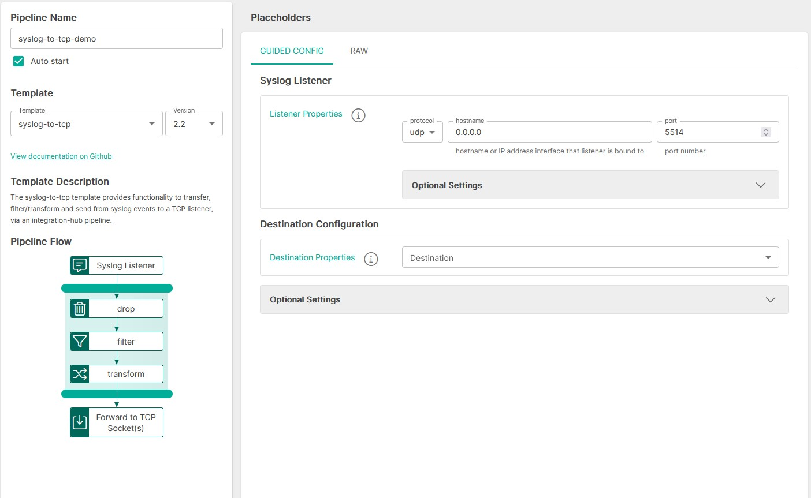

<p align="center">

</p>
<br><br>

# Syslog to TCP Listener (syslog-to-tcp v2.2)

**Important:** _These instructions assume you have Integration Hub v2.4+ installed_

- For help installing [Integration Hub](https://docs.interlinksoftware.com/ih/latest/index.html), see the [Installation Guide](https://docs.interlinksoftware.com/ih/latest/install/install_overview.html).

## What's new in syslog-to-tcp v2.2

| Enhancement or Feature               | ID                                                      |
| :--------------------- | :--------------------------------------------------------------- |
| Update 'destinationServers' field in the uiSchema to use the new 'outputtarget' selector            | IH-730       |
| Replace destination logic with the new 'destination' method which now uses the new Output Target functionality            | IH-730                                      |

## Overview

The syslog-to-tcp template creates a syslog listener that client applications can target to transfer data via a syslog. The integration-hub pipeline transfers, filters/transforms and updates the data, passing it out to the target TCP Listener.

## Prerequisites

Before creating the pipeline you will need have the following configured:

- An [Output Target](https://github.com/interlinksoftware/integrationhub/tree/main/templates/syslog-to-tcp#defining-an-output-target), defining the destination for the processed data.

- The template is installed and is available within the user interface. Install directly from github or transfer the template to your Integration Hub server.

  - Installing directly from Github:

    ```
    ih-cli template import https://raw.githubusercontent.com/interlinksoftware/integrationhub/main/templates/syslog-to-tcp/2.2/syslog-to-tcp~2.2.yml
    ```

  - Install from local file. Place the template file in the `integration-hub/config/templates` directory, then run:

    ```
    ih-cli template import <path to template file>
    ```

  **Note:** _You will need to reload the configuration after importing a template before you can use it, to do this run:_

  ```
  ih-cli config reload
  ```

## Configuration

From the Pipelines section of the user interface you can create, update and delete pipelines. The following properties can be set for your pipeline.



### Expression Syntax

Please be aware that the settings below make use of the following expression syntax

- Allow / Deny List
- Filters

<br />

<table>
<tr>
    <th>Property</th>
    <th>Description</th>
</tr>
<tr valign="top">
    <td><code>Expression</code></td>
    <td>
        <blockquote><strong>field</strong> <i>operator</i> <strong>value</strong></blockquote>
        <br>
        <code>field:</code> The field that is referenced from the incoming message. To match this against the whole string, use <code>${bodyAs(String)}</code>
        <br>
        <code>value:</code> The value being tested against
        <br></br>
        <strong>operators:</strong>
        <br></br>
        <table>
            <tr>
                <th>Operator</th>
                <th>Description</th>
            </tr>
            <tr>
                <td><code>==</code></td>
                <td>equals</td>
            </tr>
            <tr>
                <td><code>=~</code></td>
                <td>equals (case insensitive)</td>
            </tr>
            <tr>
                <td><code>!=</code></td>
                <td>does not equal</td>
            </tr>
            <tr>
                <td><code>!=~</code></td>
                <td>does not equal (case insensitive)</td>
            </tr>
            <tr>
                <td><code>contains</code></td>
                <td>contains string</td>
            </tr>
            <tr>
                <td><code>!contains</code></td>
                <td>does not contain</td>
            </tr>
            <tr>
                <td><code>regex</code></td>
                <td>matches regex string</td>
            </tr>
            <tr>
                <td><code>!regex</code></td>
                <td>does not match regex string</td>
            </tr>
            <tr>
                <td><code>&&</code></td>
                <td>AND multiple expressions</td>
            </tr>
            <tr>
                <td><code>||</code></td>
                <td>OR multiple expressions</td>
            </tr>
        </table>
        <br>
        <strong>See examples below:</strong>
        <br></br>
        <table>
            <tr>
                <th>Expression</th>
                <th>Description</th>
            </tr>
            <tr>
                <td><code>${bodyAs(String)} regex '(?s)(.*?)'</code></td>
                <td>matches any string</td>
            </tr>
            <tr>
                <td><code>${bodyAs(String)} =~ 'this' && ${bodyAs(String)} !=~ 'that'</code></td>
                <td>incoming message contains 'this' but not 'that'</td>
            </tr>
            <tr>
                <td><code>${bodyAs(String)} =~ 'dog' || ${bodyAs(String)} !=~ 'cat'</code></td>
                <td>incoming message contains 'dog' or 'cat'</td>
            </tr>
            <tr>
                <td><code>${body[username]} == 'ppadmin'</code></td>
                <td>incoming message field 'username' equals 'ppadmin'</td>
            </tr>
            <tr>
                <td><code>${body[username]} != null</code></td>
                <td>incoming message field 'username' is not null</td>
            </tr>
            <tr>
                <td><code>${body[origindate]} == ${date:now:yyyyMMdd}</code></td>
                <td>incoming message field 'origindate' equals todays date</td>
            </tr>
        </table>
    </td>
</tr>
</table>

<br />

### Syslog Listener

| Property               | Description                                                      |
| :--------------------- | :--------------------------------------------------------------- |
| `Protocol`             | The protocol the listener will use (UDP \| TCP)       |
| `Hostname`             | Host/IP address to bind the listener to                                      |
| `Port`                 | Port to bind the listener to                                     |


#### Optional Settings

| Property                      | Description                                                                                                                     |
| :---------------------------- | :------------------------------------------------------------------------------------------------------------------------------ |
| `Path`                        | The path to listen on for requests                                                                                              |


<br />

If `Enable basic authentication` is set to `true`, you will be required to define a map of users and passwords who will be allowed to send requests to this listener

### Destination Configuration

The destination configuration specifies where the processed data should be sent. You can choose a single output target or configure multiple targets as needed.


### Optional Settings

#### Allow / Deny List

You can tailor message processing and transmission to the TCP listener based on an [expression](#expression-syntax) by configuring the Allow/Deny list


<br />

#### Filters

The filter and formatting logic grants us the ability to customize the appearance of alerts as they are sent to the TCP listener.


#### Format

The format output redefines how you wish to transform the message, the following fields are available for syslog messages.

The default ${auto} format produces a message in the following format
```
SyslogLocalAddress = VALUE | SyslogRemoteAddress = VALUE | SyslogFacility = VALUE | SyslogHostname = VALUE | SyslogSeverity = VALUE | SyslogTimestamp = VALUE | SyslogMessage = VALUE 
```

You can re-format the message if required, you can reference the fields listed in the table below by using `${body.FIELD}` (ie: `${body.SyslogHostname}`).

Setting the format:
```
SYSLOG_MESSAGE date = ${body.SyslogTimestamp} | message = ${body.SyslogMessage}
```
would produce messages in the following format:
```
SYSLOG_MESSAGE date = 2023-10-20T11:52:11.976+01:00 | message = My Test Message
```

<br>

| Field                      | Description                                                                                                                     |
| :---------------------------- | :------------------------------------------------------------------------------------------------------------------------------ |
| `SyslogLocalAddress`                 | The syslog listener address
| `SyslogRemoteAddress`                 | The syslog client address
| `SyslogFacility`                        | The facility (category) set on the message       
| `SyslogHostname`            | The syslog server receiving the message (Integration Hub Server)
| `SyslogSeverity`            | The severity level send
| `SyslogTimestamp`            | The date/time of the message in ISO8601 format
| `SyslogMessage`            | The syslog message            

<br />