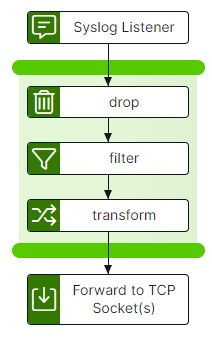

# syslog-to-tcp Template

The syslog-to-tcp template creates a syslog listener that client applications can target to transfer data via a syslog. The integration-hub pipeline transfers, filters/transforms and updates the data, passing it out to the target TCP Listener.

