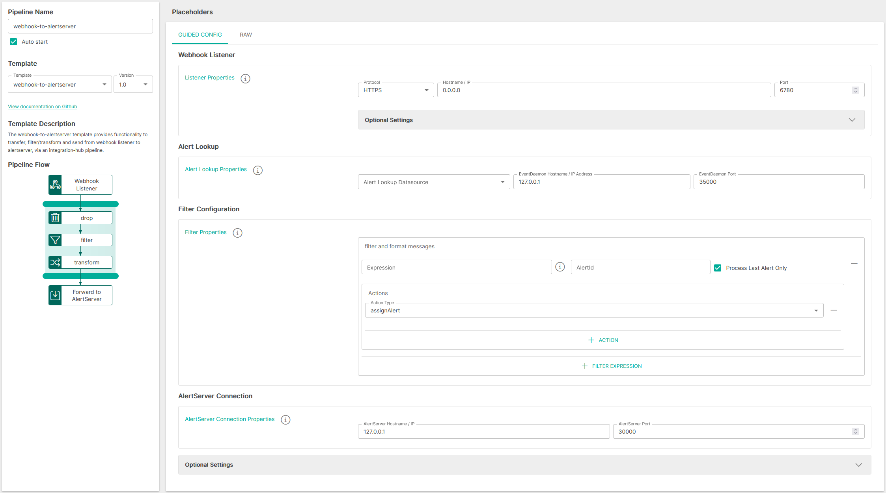

<p align="center">

</p>
<br><br>

# Webhook to AlertServer (webhook-to-alertserver v1.0)

**Important:** _These instructions assume you have Integration Hub v2.2+ installed_

- For help installing [Integration Hub](https://docs.interlinksoftware.com/ih/latest/index.html), see the [Installation Guide](https://docs.interlinksoftware.com/ih/latest/install/install_overview.html).

## Overview

The webhook-to-alertserver template provides functionality to transfer, filter/transform and send from webhook listener to alertserver, via an integration-hub pipeline.

## Prerequisites

Before creating the pipeline you will need have the following configured:

- The template is installed and is available within the user interface. Install directly from github or transfer the template to your Integration Hub server.

  - Installing directly from Github:

    ```
    ih-cli template import https://raw.githubusercontent.com/interlinksoftware/integrationhub/main/templates/webhook-to-alertserver/1.0/webhook-to-alertserver~1.0.yml
    ```

  - Install from local file. Place the template file in the `integration-hub/config/templates` directory, then run:

    ```
    ih-cli template import <path to template file>
    ```

  **Note:** _You will need to reload the configuration after importing a template before you can use it, to do this run:_

  ```
  ih-cli config reload
  ```

## Configuration

From the Pipelines section of the user interface you can create, update and delete pipelines. The following properties can be set for your pipeline.



### Webhook Listener

| Property               | Description                                                      |
| :--------------------- | :--------------------------------------------------------------- |
| `Protocol`             | The http protocol for the webhook listener       |
| `Hostname / IP`             | Host/IP address to bind the listener to                                      |
| `Port`                 | Port to bind the listener to                                     |

#### Optional Settings

| Property               | Description                                                      |
| :--------------------- | :--------------------------------------------------------------- |
| `Path`             | The path to listen on for requests       |
| `sslContextParameters`             | Reference to the ssl configuration to enable SSL on the pipeline to                                      |
| `API Key`                 | Only requests with this present will be able to process data                                     |

<br />

If `Enable basic authentication` is set to `true`, you will be required to define a map of users and passwords who will be allowed to send requests to this listener

If `Enable Throttling` is set to `true`, the following properties are required:

| Property               | Description                                                      |
| :--------------------- | :--------------------------------------------------------------- |
| `Throttle Count`              | Maximum number of incoming messages that can be ingested within the defined throttle period       |
| `Throttle Period` | The time period during which the throttle count is valid for |

<br />

### Alert Lookup

When looking up an alert. This pipeline will first attempt to find the alert in the EventDaemon. If no alert is found, the Alert Lookup Datasource will be used.

The following properties can be specified for Alert Lookup.

| Property               | Description                                                      |
| :--------------------- | :--------------------------------------------------------------- |
| `Alert Lookup Datasource`              | The name of the datasource that will be used to lookup alerts<br /><br />_This datasource should be configured to use the **besdb** database_       |
| `EventDaemon Hostname / IP Address` | The hostname / IP address of the system that is running Event Daemon |
| `EventDaemon Port` |  	The port that the EventDaemon is listening on |

<br />

### Filter Configuration

The following properties can be specified for the filters:

| Property               | Description                                                      |
| :--------------------- | :--------------------------------------------------------------- |
| `Expression`              |  	The expression which determines the action to take based on the incoming message       |
| `AlertId` | The GMOM alertId from the incoming message |
| `Process Last Alert Only` | When enabled, only processes the last alert from the incoming message<br/><br/><blockquote><i>This feature is useful in cases where multiple objects share identical alertIds</i></blockquote> |

<br />

#### Actions

<blockquote style="color: red"><i><b>IMPORTANT:</b> There is a known bug with Integration Hub that renders the 'Actions' unusable in the UI -- Please refer to the pipeline example </i></blockquote>

<br />

| Property               | Description                                                      |
| :--------------------- | :--------------------------------------------------------------- |
| `Action Type`              |  	The type of action to execute in the AlertServer       |

<blockquote><i>Depending on the action type, the following fields are required</i></blockquote>

<br />

`[assignAlert], [closeAlert]`

| Property               | Description                                                      |
| :--------------------- | :--------------------------------------------------------------- |
| `User`              |  	The name of the user in BES that is responsble for this action      |

<br />

`[addNote]`

| Property               | Description                                                      |
| :--------------------- | :--------------------------------------------------------------- |
| `Value`              |  	The value to add to the alert      |

<br />

**Pipeline Example** (_Assigning a user to the Alert & adding a note_):

```yaml
actions:
- type: assignAlert
    user: ppadmin
- type: addNote
    fieldValue: Received request code ${body[actionCode]} - Alert ${body[gmomEventID]} has been assigned to ppadmin

```

**Pipeline Example** (_Closing an Alert & adding a note_):

```yaml
actions:
- type: closeAlert
    user: ppadmin
- type: addNote
    fieldValue: Received request code ${body[actionCode]} - Alert has been closed by ppadmin
```

### AlertServer Connection

The following properties can be specified for the AlertServer Connection.

| Property               | Description                                                      |
| :--------------------- | :--------------------------------------------------------------- |
| `AlertServer Hostname / IP`              |  	 	The hostname or IP address of the AlertServer      |
| `AlertServer Port`              |  	 	The port that AlertServer is listening on      |

<br />

### Optional Settings

#### Expression Syntax

Please be aware that the settings below make use of the following expression syntax

- Filters
- Allow / Deny List
- Pre-process Headers

<br />

<table>
<tr>
    <th>Property</th>
    <th>Description</th>
</tr>
<tr valign="top">
    <td><code>Expression</code></td>
    <td>
        <blockquote><strong>field</strong> <i>operator</i> <strong>value</strong></blockquote>
        <br>
        <code>field:</code> The field that is referenced from the incoming message. To match this against the whole string, use <code>${bodyAs(String)}</code>
        <br>
        <code>value:</code> The value being tested against
        <br></br>
        <strong>operators:</strong>
        <br></br>
        <table>
            <tr>
                <th>Operator</th>
                <th>Description</th>
            </tr>
            <tr>
                <td><code>==</code></td>
                <td>equals</td>
            </tr>
            <tr>
                <td><code>=~</code></td>
                <td>equals (case insensitive)</td>
            </tr>
            <tr>
                <td><code>!=</code></td>
                <td>does not equal</td>
            </tr>
            <tr>
                <td><code>!=~</code></td>
                <td>does not equal (case insensitive)</td>
            </tr>
            <tr>
                <td><code>contains</code></td>
                <td>contains string</td>
            </tr>
            <tr>
                <td><code>!contains</code></td>
                <td>does not contain</td>
            </tr>
            <tr>
                <td><code>regex</code></td>
                <td>matches regex string</td>
            </tr>
            <tr>
                <td><code>!regex</code></td>
                <td>does not match regex string</td>
            </tr>
            <tr>
                <td><code>&&</code></td>
                <td>AND multiple expressions</td>
            </tr>
            <tr>
                <td><code>||</code></td>
                <td>OR multiple expressions</td>
            </tr>
        </table>
        <br>
        <strong>See examples below:</strong>
        <br></br>
        <table>
            <tr>
                <th>Expression</th>
                <th>Description</th>
            </tr>
            <tr>
                <td><code>${bodyAs(String)} regex '(?s)(.*?)'</code></td>
                <td>matches any string</td>
            </tr>
            <tr>
                <td><code>${bodyAs(String)} =~ 'this' && ${bodyAs(String)} !=~ 'that'</code></td>
                <td>incoming message contains 'this' but not 'that'</td>
            </tr>
            <tr>
                <td><code>${bodyAs(String)} =~ 'dog' || ${bodyAs(String)} !=~ 'cat'</code></td>
                <td>incoming message contains 'dog' or 'cat'</td>
            </tr>
            <tr>
                <td><code>${body[username]} == 'ppadmin'</code></td>
                <td>incoming message field 'username' equals 'ppadmin'</td>
            </tr>
            <tr>
                <td><code>${body[username]} != null</code></td>
                <td>incoming message field 'username' is not null</td>
            </tr>
            <tr>
                <td><code>${body[origindate]} == ${date:now:yyyyMMdd}</code></td>
                <td>incoming message field 'origindate' equals todays date</td>
            </tr>
        </table>
    </td>
</tr>
</table>

<br />

#### Pre-process Headers

The pre-process headers feature allow you to define a collection of [expressions](#expression-syntax) and headers for fine-tuning incoming data prior to processing.


<br />

| Parameter | Type                                                                                                                                                                                                                      |
| :-------- | :------------------------------------------------------------------------------------------------------------------------------------------------------------------------------------------------------------------------ |
| `Headers` | The headers to set when a defined expression matches <br /><br /> `Header Name`: The name of the header. For example: `Content-Type` <br /><br /> `Header Value`: The value of the header. For example `application/json` |

<br />

#### Allow / Deny List

You can tailor message processing and transmission to the TCP listener based on an [expression](#expression-syntax) by configuring the Allow/Deny list


<br />

#### Logging

| Parameter        | Type                                                                                                                                              |
| :--------------- | :------------------------------------------------------------------------------------------------------------------------------------------------ |
| `logReceived`    | If enabled all messages received will be captured, the maximum number of entries is controlled by the `uiMessageLimit` property                   |
| `logDropped`     | If enabled all messages dropped will be captured, the maximum number of entries is controlled by the `uiMessageLimit` property                    |
| `logProcessed`   | If enabled all messages processed will be captured, the maximum number of entries is controlled by the `uiMessageLimit` property                  |
| `logSuccess`     | If enabled all messages that were successfuly sent will be captured, the maximum number of entries is controlled by the `uiMessageLimit` property |
| `logFailed`      | If enabled all messages that have failed will be captured, the maximum number of entries is controlled by the `uiMessageLimit` property           |
| `uiMessageLimit` | Specifies the maximum number of messages to store for this pipeline, the default is `200`                                                         |