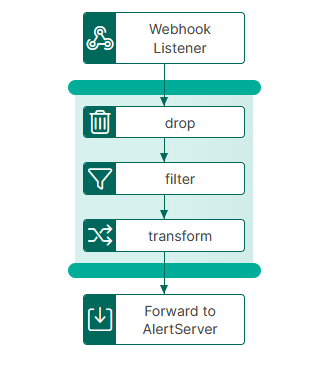

# webhook-to-alertserver Template

The webhook-to-alertserver template provides functionality to transfer, filter/transform and send from webhook listener to alertserver, via an integration-hub pipeline.

