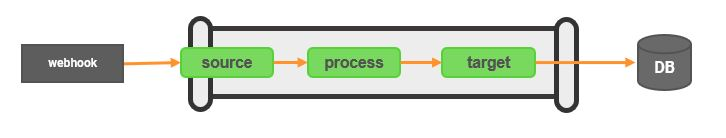

# webhook-to-db Template

The webhook-to-db template provides a secure HTTP endpoint that 3rd Party applications can target to transfer data via a webhook.  The integration-hub pipeline transfers, filters/transforms and updates the data, sending it on to the target database using JDBC.

<p align="center">

</p>

***

## Install

Download the version of the webhook-to-tcp template that you require from github to your integration-hub server.

Run the following to install directly from Github:
<font size="1">
```bash
ih-cli template import \
  https://raw.githubusercontent.com/interlinksoftware/integrationhub/main/templates/webhook-to-db/<version>/readme.md
```
  </font>
  
If your server does not have access to Github you can download the template file and place it in the ```integration-hub/config/templates``` directory.
***

## Configure

This template will require you to install the relevant JDBC drivers and define the Data Sources that you wish to use.

### Installing JDBC Drivers

For the integration-hub to support the database(s) you wish to use, you will need to copy the relevant JDBC driver(s) jar files into the **integration-hub/config/lib** directory, then restart the integration-hub to make them available within the pipeline.

|database drivers|
---------|
|[Postgres][postgres_download]|
|[Oracle][oracle_download]|
|[Microsoft SQL Server][sqlserver_download]

[postgres_download]: https://jdbc.postgresql.org/download.html
[oracle_download]: https://www.oracle.com/uk/database/technologies/appdev/jdbc-downloads.html
[sqlserver_download]: https://docs.microsoft.com/en-us/sql/connect/jdbc/download-microsoft-jdbc-driver-for-sql-server?view=sql-server-ver15

### Defining Data Source Definitions

Configure the connection details for any new databases required for use in the pipeline.  The connection details are defined in the **integration-hub/config/datasources.yml** file on the integration-hub instance.

The following properties are mandatory for each connection. (For a comprehensive list of additional properties see the <a href="https://commons.apache.org/proper/commons-dbcp/configuration.html" target="_isspop">commons-dcp</a> specification):


|Property | Value|
|----------|------|
|driverClassName | Fully qualified Java class name of the JDBC driver to be used|
|url | JDBC connection Url|
|username | Database username|
|password | Encrypted database password|

You can refer to secrets from the management-service vault within the configuration file by enclosing them with `${}`:

```yml
  ${sqlserver_password}
```

For more information on how this is done refer to the vault section of the management-service on the Interlink documentation site.

#### Data Source Examples

```
    postgresExample:
        type: org.apache.commons.dbcp2.BasicDataSource
        driverClassName: org.postgresql.Driver
        username: ${postgres_username}
        password: ${postgres_password}
        url: "jdbc:postgresql://postgres.interlink.com:5432/mydb"

    sqlServerExample:
        type: org.apache.commons.dbcp2.BasicDataSource
        driverClassName: net.sourceforge.jtds.jdbc.Driver
        username: ${sqlserver_username}
        password: ${sqlserver_password}
        url: "jdbc:jtds:sqlserver://sqlserver.interlink.com;databaseName=mydb;"
        validationQuery: "select 1"
```
  
### REST api against datasources

You can read data back from any datasource defined in the pipeline file, this is in the form of ```/<datasource>/<table>?<field>=<value>&<field>=<value>```

Running a GET againt https://myserver.com:6767/database1/users?lastname=smith&dapartment=it would return all records from the ```users``` table in the ```database1``` datasource where the field ```lastname``` is ```smith``` and ```department``` is ```it```

### Creating a pipeline

You will need to create a pipeline to use a template. A sample pipeline definition is detailed in the README for each version of the template under the relevant directory, use that as a base for your pipeline.
