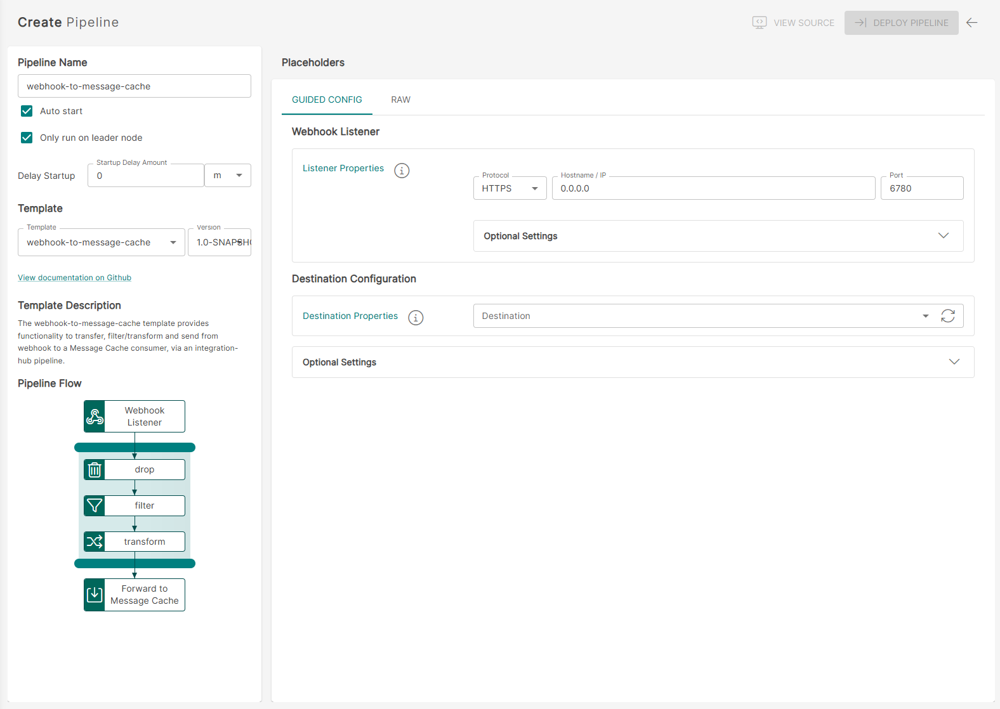
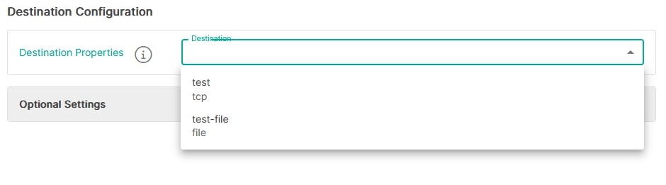
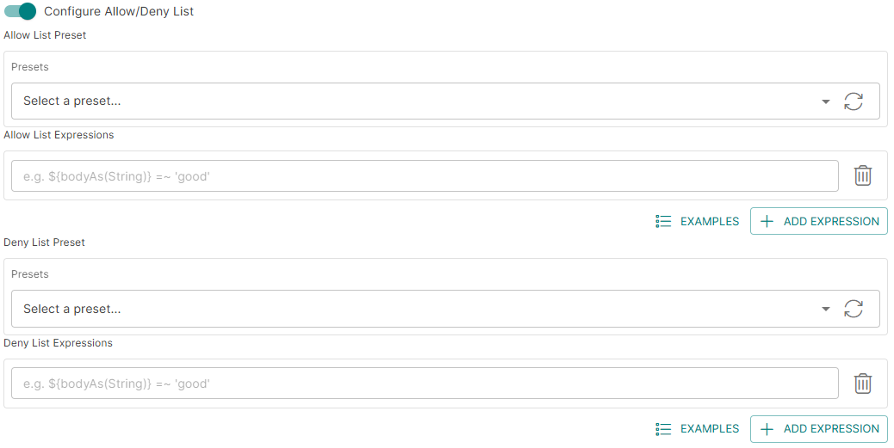
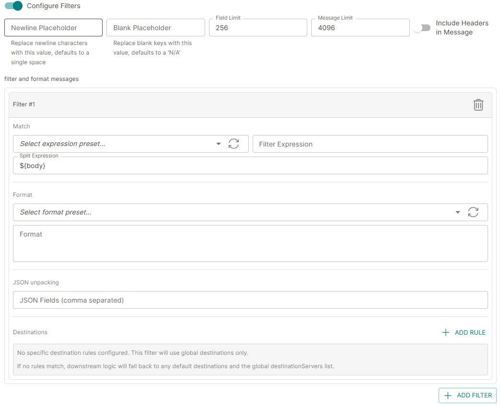
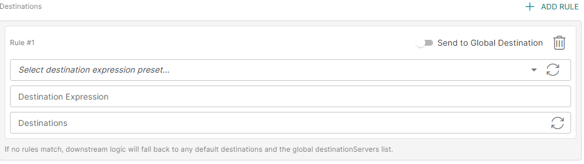

<p align="center">
  
</p>

# Webhook to ISS Message Cache (`webhook-to-message-cache` v1.0)

> **Important**  
> These instructions assume you have **Integration Hub v3.1+** installed.

For help installing Integration Hub, see the official documentation:

- [Integration Hub Documentation](https://docs.interlinksoftware.com/ih/latest/index.html)
- [Installation Guide](https://docs.interlinksoftware.com/ih/latest/install/install_overview.html)

---

## Overview

The `webhook-to-message-cache` template provides functionality to transfer, filter, transform, and send data from a webhook to an ISS Message Cache consumer via an Integration Hub pipeline.

---

## Prerequisites

Before creating the pipeline, ensure the following are configured:

- A working version of ISS Message Cache. See [Configure the ISS Message Cache](https://docs.interlinksoftware.com/ih/3.1.1/administration/message_cache_setup.html)
- An [Output Target](https://github.com/interlinksoftware/integrationhub/tree/main/templates/syslog-to-tcp#defining-an-output-target) defining the destination for the processed data.
- The template is installed and available within the user interface.

### Install the Template

#### Option 1: Install directly from GitHub

```bash
ih-cli template import https://raw.githubusercontent.com/interlinksoftware/integrationhub/main/templates/webhook-to-message-cache/1.0/webhook-to-message-cache~1.0.yml
```

#### Option 2: Install from a local file

Place the template file in the `integration-hub/config/templates` directory, then run:

```bash
ih-cli template import <path to template file>
```

> **Note**  
> After importing a template, you must reload the configuration before it can be used:

```bash
ih-cli config reload
```

---

## Configuration

From the **Pipelines** section of the user interface, you can create, update, and delete pipelines. The following properties can be set for your pipeline.

<p align="center">
  
</p>

---

## Expression Syntax

The following settings make use of the expression syntax described below:

- Pre-process Headers
- Allow / Deny List
- Filters

### Expression Format

```text
field operator value
```

Where:

- **field**: The field referenced from the incoming message.  
  To match against the entire message body, use:

  ```text
  ${bodyAs(String)}
  ```

- **value**: The value being tested against.

### Supported Operators

| Operator    | Description                       |
| ----------- | --------------------------------- |
| `==`        | equals                            |
| `=~`        | equals (case insensitive)         |
| `!=`        | does not equal                    |
| `!=~`       | does not equal (case insensitive) |
| `contains`  | contains string                   |
| `!contains` | does not contain                  |
| `regex`     | matches regex string              |
| `!regex`    | does not match regex string       |
| `&&`        | AND multiple expressions          |
| `\|\|`      | OR multiple expressions           |

### Examples

| Expression                                                    | Description                                             |
| ------------------------------------------------------------- | ------------------------------------------------------- |
| `${bodyAs(String)} regex '(?s)(.*?)'`                         | Matches any string                                      |
| `${bodyAs(String)} =~ 'this' && ${bodyAs(String)} !=~ 'that'` | Incoming message contains `this` but not `that`         |
| `${bodyAs(String)} =~ 'dog' \|\| ${bodyAs(String)} !=~ 'cat'` | Incoming message contains `dog` or `cat`                |
| `${body[username]} == 'ppadmin'`                              | Incoming message field `username` equals `ppadmin`      |
| `${body[username]} != null`                                   | Incoming message field `username` is not null           |
| `${body[origindate]} == ${date:now:yyyyMMdd}`                 | Incoming message field `origindate` equals today’s date |

---

## Webhook Listener

| Property               | Description                                                      |
| ---------------------- | ---------------------------------------------------------------- |
| `Protocol`             | The HTTP protocol for the webhook listener (`HTTP` or `HTTPS`)   |
| `Hostname / IP`        | Host to bind the listener to                                     |
| `Port`                 | Port to bind the listener to                                     |
| `sslContextParameters` | Reference to the SSL configuration to enable SSL on the pipeline |

### Optional Settings

| Property            | Description                                                         |
| ------------------- | ------------------------------------------------------------------- |
| `Path`              | The path to listen on for requests                                  |
| `API Key`           | Only requests containing this value will be allowed to process data |
| `Enable Basic Auth` | Toggle to enable basic authentication on the endpoint               |
| `Enable Throttling` | Toggle to enable throttling of incoming messages on the endpoint    |

If **Enable Basic Auth** is set to `true`, you must define a map of usernames and passwords that are allowed to send requests to this listener.

If **Enable Throttling** is set to `true`, the following properties are required:

| Property          | Description                                                                                 |
| ----------------- | ------------------------------------------------------------------------------------------- |
| `Throttle Count`  | Maximum number of incoming messages that can be ingested within the defined throttle period |
| `Throttle Period` | The time period during which the throttle count is valid                                    |

---

## Destination Configuration

The destination configuration specifies where the processed data should be sent. You can choose a single output target or configure multiple targets as needed.

> **Important**  
> Ensure that you select your **KAFKA Output Target**.

<p align="center">
  
</p>

---

## Optional Settings

### Allow / Deny List

You can tailor message processing and transmission to the ISS Message Cache based on an [expression](#expression-syntax) by configuring the Allow / Deny List.

<p align="center">
  
</p>

| Property                      | Description                                                                                                                                                                                                                                       |
| ----------------------------- | ------------------------------------------------------------------------------------------------------------------------------------------------------------------------------------------------------------------------------------------------- |
| `Presets`                     | Reference to a **Group Expression** list containing pre-defined expressions to apply to your **Allow / Deny List**. See [Group Expressions](https://docs.interlinksoftware.com/ih/3.1.1/administration/expression_groups.html#_group_expressions) |
| `Allow/Deny List Expressions` | Inline expressions to apply to your **Allow / Deny List** (can be used instead of setting a **Preset**)                                                                                                                                           |

---

### Filters

The filter and formatting logic allows you to customize the appearance of alerts as they are sent to the TCP listener.

<p align="center">
  
</p>

| Property            | Description                                                                                                                                                                                                                                          |
| ------------------- | ---------------------------------------------------------------------------------------------------------------------------------------------------------------------------------------------------------------------------------------------------- |
| `Presets`           | Reference to a **Group Expression** list containing pre-defined expressions to apply to your **Filter** configuration. See [Group Expressions](https://docs.interlinksoftware.com/ih/3.1.1/administration/expression_groups.html#_group_expressions) |
| `Filter Expression` | Inline expressions to apply to your **Filter** configuration (can be used instead of setting a **Preset**)                                                                                                                                           |
| `Split Expression`  | Allows you to split a payload containing an array into multiple events. By default, it will split the main body of the message. See [Split](#split).                                                                                                 |
| `Format`            | Redefines how you wish to transform the message. See [Format](#format).                                                                                                                                                                              |
| `Destinations`      | Allows you to dynamically route messages to one or more destinations based on expressions. See [Filter Destinations](#filter-destinations)                                                                                                           |

---

## Format

<details>
<summary><strong>JSON Example</strong></summary>

### Incoming Message

```json
{
  "user": {
    "name": "ppadmin",
    "uid": 229,
    "group": "ppusers"
  },
  "origindate": "2022-12-15 12:01:34"
}
```

### Auto Mapping

You can use auto-mapping to automatically translate incoming messages into alerts.

To enable this feature, define `${auto}` within the format field.

For example:

```text
UserAlert ${auto}
```

This would yield output similar to:

```text
UserAlert datetime = 2022-12-15 12:01:34 | name = ppadmin | group = ppusers | Accept = text/plain, application/xml, text/xml, application/json, application/*+xml, application/*+json, */* | Accept-Encoding = gzip,deflate | Connection = keep-alive | Content-Length = 114 | Content-Type = application/json | correlationId = 43CA053BE23B183-0000000000000002 | Host = localhost:30052 | HttpCharacterEncoding = UTF-8 | HttpMethod = POST | HttpPath = N/A | HttpQuery = null | HttpUri = / | HttpUrl = http://localhost:30052/ | parentId = 43CA053BE23B183-0000000000000001 | ServletContextPath = / | User-Agent = Apache-HttpClient/4.5.13 (Java/1.8.0_241)
```

### Pre-defined Mapping

You can also manually translate incoming messages into alerts.

For example:

```text
UserAlert datetime = ${body[origindate]} | name = ${body[user][name]} | group = ${body[user][group]} |
```

This would yield:

```text
UserAlert datetime = 2022-12-15 12:01:34 | name = ppadmin | group = ppusers |
```

</details>

<details>
<summary><strong>JSON Array Example</strong></summary>

### Incoming Message

```json
{
  "testfield": "VALUE1",
  "testfield2": "VALUE2",
  "nested": {
    "nestedField": "hello"
  },
  "array": ["array1", "array2", "array3"]
}
```

### Auto Mapping

For a JSON array, you can also use auto-mapping to automatically translate the incoming message into an alert.

To enable this, define `${auto}` within the format field.

For example:

```text
UserAlert ${auto}
```

Example output:

```text
The format output redefines how you wish to transform the message
```

### Pre-defined Mapping

You can also manually translate a JSON array into an alert.

For example:

```text
UserAlert firstOne = ${body[array[0]]} | msg = ${body[nested][nestedField]} |
```

This would yield:

```text
UserAlert firstOne = array1 | msg = hello |
```

</details>

---

## Split

The split expression allows you to split a payload containing an array into multiple events. By default, it will split the main body of the message.

<details>
<summary><strong>JSON Array Example</strong></summary>

By default, the payload will be split if it is an array.

### Incoming Message

```json
[
  {
    "user": {
      "name": "ppadmin",
      "uid": 229,
      "group": "ppusers"
    },
    "origindate": "2022-12-15 12:01:34"
  },
  {
    "user": {
      "name": "Jeff",
      "uid": 456,
      "group": "ppusers"
    },
    "origindate": "2022-12-15 15:56:27"
  }
]
```

This results in **two messages** being sent to the TCP listener.

</details>

<details>
<summary><strong>Nested Array Example</strong></summary>

If you want to split over a nested array, define the path to the array.

### Incoming Message

```json
{
  "data": [
    {
      "user": {
        "name": "ppadmin",
        "uid": 229,
        "group": "ppusers"
      },
      "origindate": "2022-12-15 12:01:34"
    },
    {
      "user": {
        "name": "Jeff",
        "uid": 456,
        "group": "ppusers"
      },
      "origindate": "2022-12-15 15:56:27"
    }
  ]
}
```

The split expression to access the `data` array would be:

```text
${body[data]}
```

</details>

---

## Filter Destinations

You can configure message routing based on expressions that evaluate the message content. This allows you to dynamically determine which destination or destinations a message should be sent to based on fields within the message body.

<p align="center">
  
</p>

### Example: Send only to `TCP_37584`

The following configuration sends messages only to `TCP_37584` if the `username` field in the message body is `ppadmin`:

```yaml
filters:
  - expression: ${bodyAs(String)} regex '(?s)(.*?)'
    format: ${auto}
    split: ${body}
    stringifiedJsonFields: ""
    destinations:
      - expression: ${body.username} == 'ppadmin'
        destinationNames:
          - TCP_37584
        sendToGlobalDestination: false
```

### Example: Send to both a specific destination and the global destination

To send the message to both a specific destination and the global destination, set `sendToGlobalDestination: true`:

```yaml
destinationServers:
  - TCP_27348

filters:
  - expression: ${bodyAs(String)} regex '(?s)(.*?)'
    format: ${auto}
    split: ${body}
    stringifiedJsonFields: ""
    destinations:
      - expression: ${body.username} == 'ppadmin'
        destinationNames:
          - TCP_37584
        sendToGlobalDestination: true
```

---

## Logging

| Parameter        | Description                                                                                                                   |
| ---------------- | ----------------------------------------------------------------------------------------------------------------------------- |
| `logReceived`    | If enabled, all received messages will be captured. The maximum number of entries is controlled by `uiMessageLimit`.          |
| `logDropped`     | If enabled, all dropped messages will be captured. The maximum number of entries is controlled by `uiMessageLimit`.           |
| `logProcessed`   | If enabled, all processed messages will be captured. The maximum number of entries is controlled by `uiMessageLimit`.         |
| `logSuccess`     | If enabled, all successfully sent messages will be captured. The maximum number of entries is controlled by `uiMessageLimit`. |
| `logFailed`      | If enabled, all failed messages will be captured. The maximum number of entries is controlled by `uiMessageLimit`.            |
| `uiMessageLimit` | Specifies the maximum number of messages to store for this pipeline. Default: `200`                                           |

---
