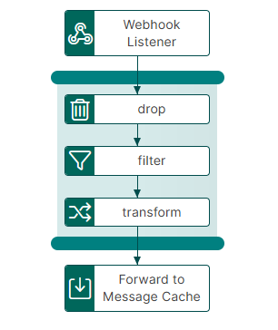
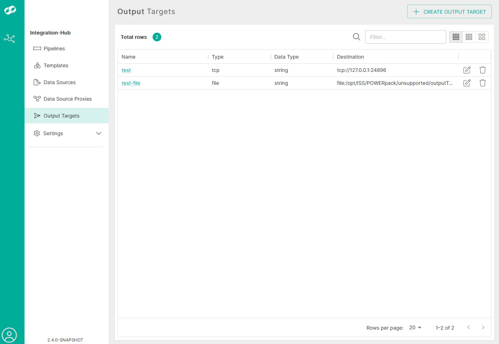
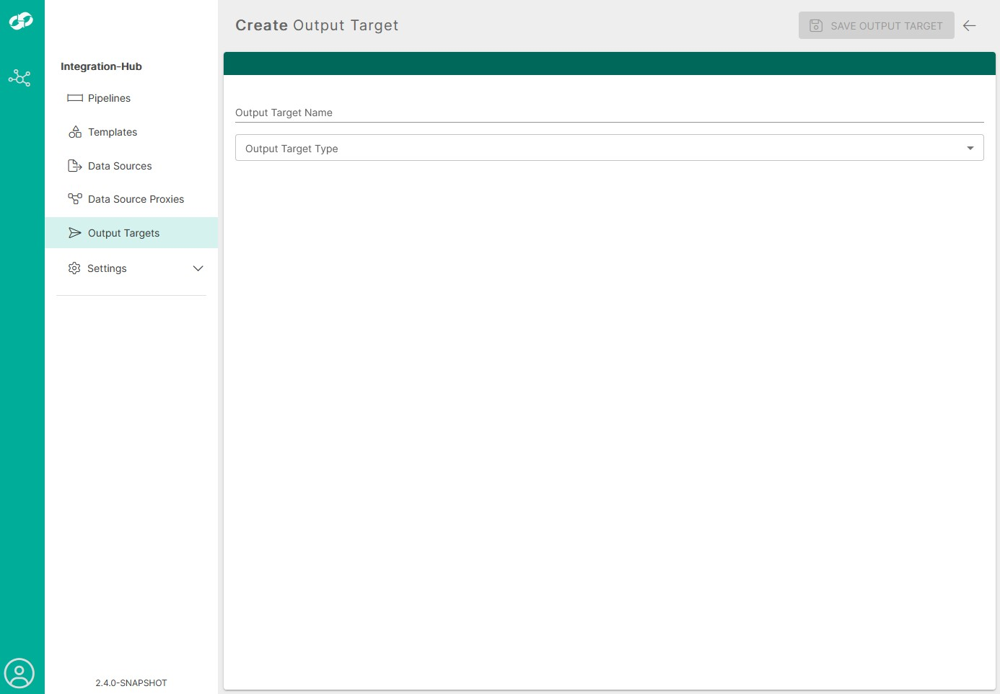
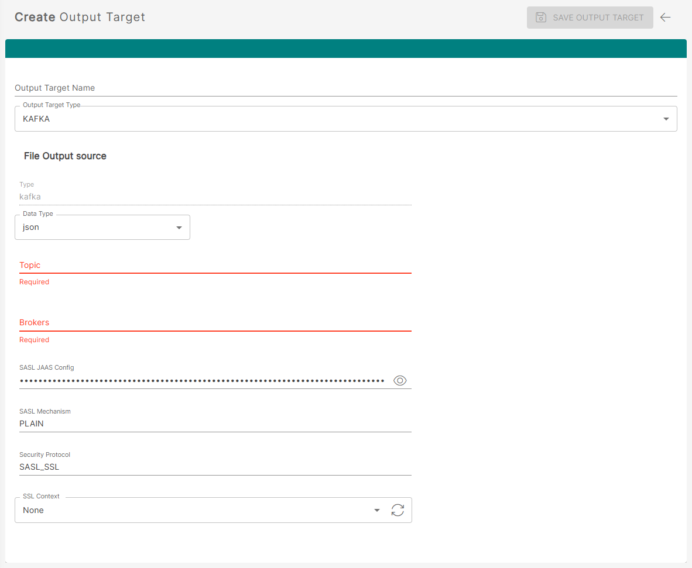

# webhook-to-message-cache Template

The webhook-to-message-cache template provides functionality to transfer, filter/transform and send from webhook to a Message Cache consumer, via an integration-hub pipeline.

## Configure

### Defining a Kafka (Message Cache) Output Target

This template requires that you have configured a Kafka (Message Cache) `Output Target`, defining the destination for the processed data.

You can access the Output Targets by clicking on the `Output Targets` navigation item on the navbar on the left.

Here you will be presented with a list of Output Targets that have been configured previously.

 

To begin creating an Output Target, click the `CREATE OUTPUT TARGET` button located on the top-right of the page.

 

Currently, there are two output targets that you can define:

| Type    | Description                                                   |
| :------ | :------------------------------------------------------------ |
| `TCP`   | Sends the processed message to a TCP listener                 |
| `FILE`  | Sends the processed message to a FILE on the local filesystem |
| `KAFKA` | Sends the processed message to a ISS Message Cache Consumer   |

#### KAFKA Properties

 

| Type                 | Description                                                                                                                                                                                                                                 |
| :------------------- | :------------------------------------------------------------------------------------------------------------------------------------------------------------------------------------------------------------------------------------------ |
| `Output Target Name` | Name of the Output Target you are creating                                                                                                                                                                                                  |
| `Data Type`          | Defines the format of the messages that will be sent to Kafka. This tells the application how to structure and serialize the outgoing payload, for example as JSON                                                                          |
| `Topic`              | The name of the Kafka topic where messages will be published. This topic must already exist unless your Kafka environment is configured to create topics automatically                                                                      |
| `Brokers`            | A comma-separated list of Kafka broker hostnames and ports used to establish the connection to the Kafka cluster. Provide one or more bootstrap servers so the application can discover the full cluster  Example: `<fqdn>:50500  ` |
| `SASL JAAS Config`   | The JAAS authentication configuration used when connecting to Kafka with SASL security enabled. This typically contains the login module and the credentials required to authenticate the client                                            |
| `SASL Mechanism`     | Specifies the SASL authentication mechanism Kafka should use, such as PLAIN or SASL_SSL. This must match the authentication method configured on the Kafka brokers.                                                                         |
| `Security Protocol`  | Defines how the client communicates securely with Kafka. For example, SASL_SSL means the connection uses both SASL authentication and SSL/TLS encryption                                                                                    |
| `SSL Context`        | Selects the SSL/TLS context or certificate configuration the application should use for secure communication with Kafka. This is typically required when the broker uses TLS, especially with internal or custom certificate authorities    |
