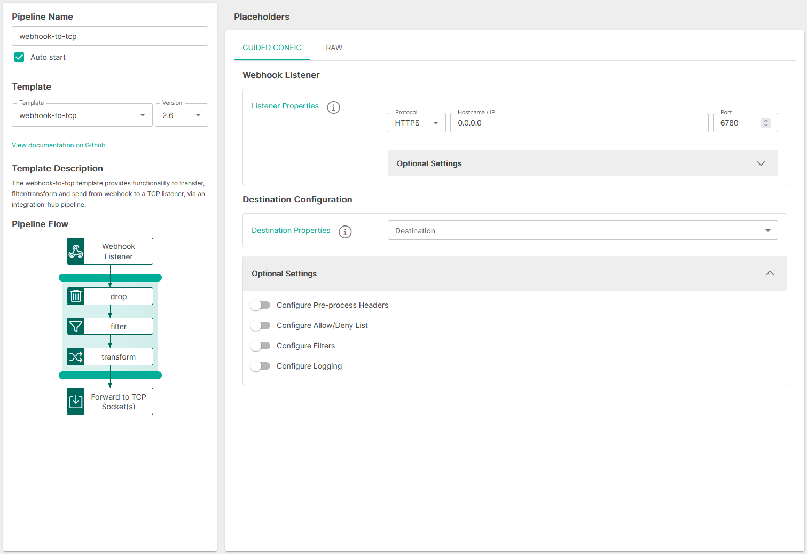
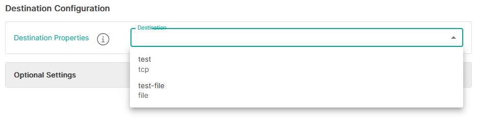
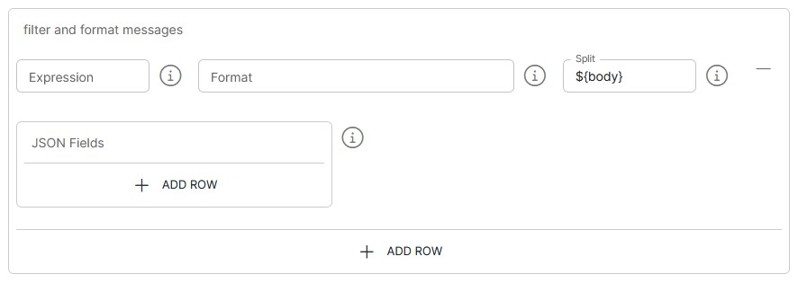

<p align="center">

</p>
<br><br>

# Webhook to TCP Listener (webhook-to-tcp v2.6)

**Important:** _These instructions assume you have Integration Hub v2.4+ installed_

- For help installing [Integration Hub](https://docs.interlinksoftware.com/ih/latest/index.html), see the [Installation Guide](https://docs.interlinksoftware.com/ih/latest/install/install_overview.html).

## What's new in webhook-to-tcp v2.6

| Enhancement or Feature               | ID                                                      |
| :--------------------- | :--------------------------------------------------------------- |
| Update 'destinationServers' field in the uiSchema to use the new 'outputtarget' selector            | IH-730       |
| Replace destination logic with the new 'destination' method which now uses the new Output Target functionality            | IH-730                                      |

## Overview

The webhook-to-tcp template provides a secure HTTP endpoint that 3rd Party applications can target to transfer data via a webhook. The integration-hub pipeline transfers, filters/transforms and updates the data, passing it out to the target TCP Listener.

## Prerequisites

Before creating the pipeline you will need have the following configured:

- An [Output Target](https://github.com/interlinksoftware/integrationhub/tree/main/templates/syslog-to-tcp#defining-an-output-target), defining the destination for the processed data.

- The template is installed and is available within the user interface. Install directly from github or transfer the template to your Integration Hub server.

  - Installing directly from Github:

    ```
    ih-cli template import https://raw.githubusercontent.com/interlinksoftware/integrationhub/main/templates/webhook-to-tcp/2.6/webhook-to-tcp~2.6.yml
    ```

  - Install from local file. Place the template file in the `integration-hub/config/templates` directory, then run:

    ```
    ih-cli template import <path to template file>
    ```

  **Note:** _You will need to reload the configuration after importing a template before you can use it, to do this run:_

  ```
  ih-cli config reload
  ```

## Configuration

From the Pipelines section of the user interface you can create, update and delete pipelines. The following properties can be set for your pipeline.



### Expression Syntax

Please be aware that the settings below make use of the following expression syntax

- Pre-process Headers
- Allow / Deny List
- Filters

<br />

<table>
<tr>
    <th>Property</th>
    <th>Description</th>
</tr>
<tr valign="top">
    <td><code>Expression</code></td>
    <td>
        <blockquote><strong>field</strong> <i>operator</i> <strong>value</strong></blockquote>
        <br>
        <code>field:</code> The field that is referenced from the incoming message. To match this against the whole string, use <code>${bodyAs(String)}</code>
        <br>
        <code>value:</code> The value being tested against
        <br></br>
        <strong>operators:</strong>
        <br></br>
        <table>
            <tr>
                <th>Operator</th>
                <th>Description</th>
            </tr>
            <tr>
                <td><code>==</code></td>
                <td>equals</td>
            </tr>
            <tr>
                <td><code>=~</code></td>
                <td>equals (case insensitive)</td>
            </tr>
            <tr>
                <td><code>!=</code></td>
                <td>does not equal</td>
            </tr>
            <tr>
                <td><code>!=~</code></td>
                <td>does not equal (case insensitive)</td>
            </tr>
            <tr>
                <td><code>contains</code></td>
                <td>contains string</td>
            </tr>
            <tr>
                <td><code>!contains</code></td>
                <td>does not contain</td>
            </tr>
            <tr>
                <td><code>regex</code></td>
                <td>matches regex string</td>
            </tr>
            <tr>
                <td><code>!regex</code></td>
                <td>does not match regex string</td>
            </tr>
            <tr>
                <td><code>&&</code></td>
                <td>AND multiple expressions</td>
            </tr>
            <tr>
                <td><code>||</code></td>
                <td>OR multiple expressions</td>
            </tr>
        </table>
        <br>
        <strong>See examples below:</strong>
        <br></br>
        <table>
            <tr>
                <th>Expression</th>
                <th>Description</th>
            </tr>
            <tr>
                <td><code>${bodyAs(String)} regex '(?s)(.*?)'</code></td>
                <td>matches any string</td>
            </tr>
            <tr>
                <td><code>${bodyAs(String)} =~ 'this' && ${bodyAs(String)} !=~ 'that'</code></td>
                <td>incoming message contains 'this' but not 'that'</td>
            </tr>
            <tr>
                <td><code>${bodyAs(String)} =~ 'dog' || ${bodyAs(String)} !=~ 'cat'</code></td>
                <td>incoming message contains 'dog' or 'cat'</td>
            </tr>
            <tr>
                <td><code>${body[username]} == 'ppadmin'</code></td>
                <td>incoming message field 'username' equals 'ppadmin'</td>
            </tr>
            <tr>
                <td><code>${body[username]} != null</code></td>
                <td>incoming message field 'username' is not null</td>
            </tr>
            <tr>
                <td><code>${body[origindate]} == ${date:now:yyyyMMdd}</code></td>
                <td>incoming message field 'origindate' equals todays date</td>
            </tr>
        </table>
    </td>
</tr>
</table>

<br />

### Webhook Listener

| Property               | Description                                                      |
| :--------------------- | :--------------------------------------------------------------- |
| `Protocol`              | The http protocol for the webhook listener (HTTP \| HTTPS)       |
| `Hostname / IP`             | Host to bind the listener to                                      |
| `Port`                 | Port to bind the listener to                                     |
| `sslContextParameters` | Reference to the ssl configuration to enable SSL on the pipeline |

#### Optional Settings

| Property                      | Description                                                                                                                     |
| :---------------------------- | :------------------------------------------------------------------------------------------------------------------------------ |
| `sslContextParameters` | Reference to the ssl configuration to enable SSL on the pipeline |
| `Path` | The path to listen on for requests |
| `API Key` | Only requests with this present will be able to process data |
| `Enable Basic Auth` | Toggle to enable basic authentication on the endpoint |
| `Enable Throttling` | Toggle to enable throttling of incoming messages on the endpoint |

<br />

If `Enable basic authentication` is set to `true`, you will be required to define a map of users and passwords who will be allowed to send requests to this listener

If `Enable Throttling` is set to `true`, the following properties are required:

| Property               | Description                                                      |
| :--------------------- | :--------------------------------------------------------------- |
| `Throttle Count`              | Maximum number of incoming messages that can be ingested within the defined throttle period       |
| `Throttle Period` | The time period during which the throttle count is valid for |

<br />

### Destination Configuration

The destination configuration specifies where the processed data should be sent. You can choose a single output target or configure multiple targets as needed.



### Optional Settings

#### Allow / Deny List

You can tailor message processing and transmission to the TCP listener based on an [expression](#expression-syntax) by configuring the Allow/Deny list


<br />

#### Filters

The filter and formatting logic grants us the ability to customize the appearance of alerts as they are sent to the TCP listener.



#### Format

The format output redefines how you wish to transform the message

<br />

<details>
<summary>JSON Example</summary>
<br />
Lets take the following incoming message:

```json
{
  "user": {
    "name": "ppadmin",
    "uid": 229,
    "group": "ppusers"
  },
  "origindate": "2022-12-15 12:01:34"
}
```

<br />

**Auto Mapping**

You can employ auto-mapping to automatically translate incoming messages into alerts. To enable this feature, simply define `${auto}` within the text field

For example, using the syntax: `UserAlert ${auto}` would yield the following output:

<br />

```
UserAlert datetime = 2022-12-15 12:01:34 | name = ppadmin | group = ppusers | Accept = text/plain, application/xml, text/xml, application/json, application/*+xml, application/*+json, */* |  Accept-Encoding = gzip,deflate |  Connection = keep-alive |  Content-Length = 114 |  Content-Type = application/json |  correlationId = 43CA053BE23B183-0000000000000002 |  Host = localhost:30052 |  HttpCharacterEncoding = UTF-8 |  HttpMethod = POST |  HttpPath = N/A |  HttpQuery = null |  HttpUri = / |  HttpUrl = [http://localhost:30052/](http://localhost:30052/) |  parentId = 43CA053BE23B183-0000000000000001 |  ServletContextPath = / |  User-Agent = Apache-HttpClient/4.5.13 (Java/1.8.0_241)
```

<br />

**Pre-defined Mapping**

You can employ pre-defined mapping to manually translate incoming messages into alerts.

For example, using the syntax: `${body[origindate]} | name = ${body[user][name]} | group = ${body[user][group]} |` would yield the following output:

<br />

```
UserAlert datetime = 2022-12-15 12:01:34 | name = ppadmin | group = ppusers |
```

</details>

<br />

<details>
<summary>JSON Array Example</summary>
    
<br />

Let's take the following incoming message:

```json
{
  "testfield": "VALUE1",
  "testfield2": "VALUE2",
  "nested": {
    "nestedField": "hello"
  },
  "array": ["array1", "array2", "array3"]
}
```

<br />
    
**Auto Mapping**
    
For a JSON Array, you can also employ auto-mapping to **automatically** translate the incoming message into an alert. To enable this feature, simply define `\${auto}` within the text field
    
For example, using the syntax: `UserAlert \${auto}` would yield the following output:
    
<br />
    
```
The format output redefines how you wish to transform the message
```
    
<br />
    
**Pre-defined Mapping**
    
You can also employ pre-defined mapping on a JSON Array to manually translate the incoming message into an alert
    
For example, using the syntax: `UserAlert firstOne = ${body[array[0]]} | msg = ${body[nested][nestedField]} |` would yield the following output:
    
<br />
    
```
UserAlert firstOne = array1 | msg = hello |
```
</details>

<br />

#### Split

The split expression allows you to split a payload containing an array into multiple events, by default it will split the main body of the message

<br />

<details>
<summary>JSON Array Example</summary>

<br />
    
By default it will split the payload if it is an array. For example:
    
<br />
    
```json
[
  {
    "user": {
      "name": "ppadmin",
      "uid": 229,
      "group": "ppusers"
    },
    "origindate": "2022-12-15 12:01:34"
  },
  {
    "user": {
      "name": "Jeff",
      "uid": 456,
      "group": "ppusers"
    },
    "origindate": "2022-12-15 15:56:27"
  }
]
```
    
<br />
    
Which will result in two message being sent to the TCP listener
    
<br />
</details>

<br />

<details>
<summary>Nested Array Example</summary>

<br />
    
If you wish to split over a nested array, you need to define the path to the "array"
    
For example, let's take the following incoming message:
    
<br />
    
```json
{
  "data": [
    {
      "user": {
        "name": "ppadmin",
        "uid": 229,
        "group": "ppusers"
      },
      "origindate": "2022-12-15 12:01:34"
    },
    {
      "user": {
        "name": "Jeff",
        "uid": 456,
        "group": "ppusers"
      },
      "origindate": "2022-12-15 15:56:27"
    }
  ]
}
```
    
<br />
    
The split expression to access the data array would be:
    
<br />
    
```
${body[data]}
```
    
<br />
</details>

<br />

#### Logging

| Parameter        | Type                                                                                                                                              |
| :--------------- | :------------------------------------------------------------------------------------------------------------------------------------------------ |
| `logReceived`    | If enabled all messages received will be captured, the maximum number of entries is controlled by the `uiMessageLimit` property                   |
| `logDropped`     | If enabled all messages dropped will be captured, the maximum number of entries is controlled by the `uiMessageLimit` property                    |
| `logProcessed`   | If enabled all messages processed will be captured, the maximum number of entries is controlled by the `uiMessageLimit` property                  |
| `logSuccess`     | If enabled all messages that were successfuly sent will be captured, the maximum number of entries is controlled by the `uiMessageLimit` property |
| `logFailed`      | If enabled all messages that have failed will be captured, the maximum number of entries is controlled by the `uiMessageLimit` property           |
| `uiMessageLimit` | Specifies the maximum number of messages to store for this pipeline, the default is `200`                                                         |