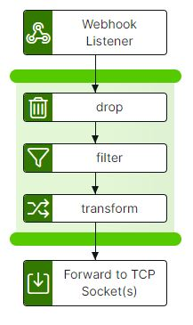

# webhook-to-tcp Template

The webhook-to-tcp template provides a secure HTTP endpoint that 3rd Party applications can target to transfer data via a webhook. The integration-hub pipeline transfers, filters/transforms and updates the data, passing it out to the target TCP Listener.

<p align="center">

</p>

## Configure

If you wish to forward to an Interlink Software BES Message Channel then you should create a TCP based Message Channel before continuing.

### Create TCP BES message channel for TCP related Integration-Hub Pipelines

Where a pipeline feeds alerts to a BES tcp message channel, a message channel may need to be created, which can be done as follows:

- Log onto the BES server as `ppadmin` and navigate to the _/opt/ISS/utils_ directory
- Execute the `createBesMessageChannel` utility file to create the BES message channel and when prompted:
- Enter the message channel name
- Enter a description for the massage channel
- Select TCP from the list of available message channel types
- Enter a port number for the message channel
- Start the message channel: `ppStart -n <TCP Message Channel Name>`

## Migrating from piHTTP to webhook-to-tcp based pipeline

If you wish to migrate from piHTTP to integration-hub, then perform the following steps:

- Ensure that the integration-hub has been installed to the BES server containing the piHTTP integration and that the `piHTTP.cfg` to be converted exists in the _/opt/ISS/POWERpack/cfg_ directory.
- Confirm you have installed the webhook-to-tcp template to the _/opt/ISS/integration-hub/config/templates_ directory.
- Create a TCP based BES Message Channel to receive the messages from the pipeline(s).
- Download the
  `convertBesPihttpToPipeline` from Github, this can be manually downloaded and placed in the **/opt/ISS/integration-hub/config** directory or using the command below as the ppadmin user.
  ```bash
  cd /opt/ISS/integration-hub/config
  curl -k -O https://raw.githubusercontent.com/interlinksoftware/integrationhub/main/templates/webhook-to-tcp/convertBesPihttpToPipeline
  chmod +x convertBesPihttpToPipeline
  ```
- Execute the conversion utility as the ppadmin user and enter both the Fully Qualified Domain Name of the target BES server and the tcp port number of the BES Message Channel created above when prompted.
  ```bash
  cd /opt/ISS/integration-hub/config
  ./convertBesPihttpToPipeline
  ```
  A new pipeline file, `piHTTP.yml`, will be created in the same directory where the `convertBesPihttpToPipeline` file resides for the piHTTP message channel being converted. To activate the converted pipeline:
- Ensure that references to both the webhook-to-tcp template and the converted pipeline .yml files have been added to the **pipelines.yml** file to add them to your integration-hub instance.
- Stop the original piHTTP message channel, if necessary, as the converted piHTTP pipeline will be listening on the original piHTTP message channel port.
- Restart the integration-hub service to pick up the changes.
